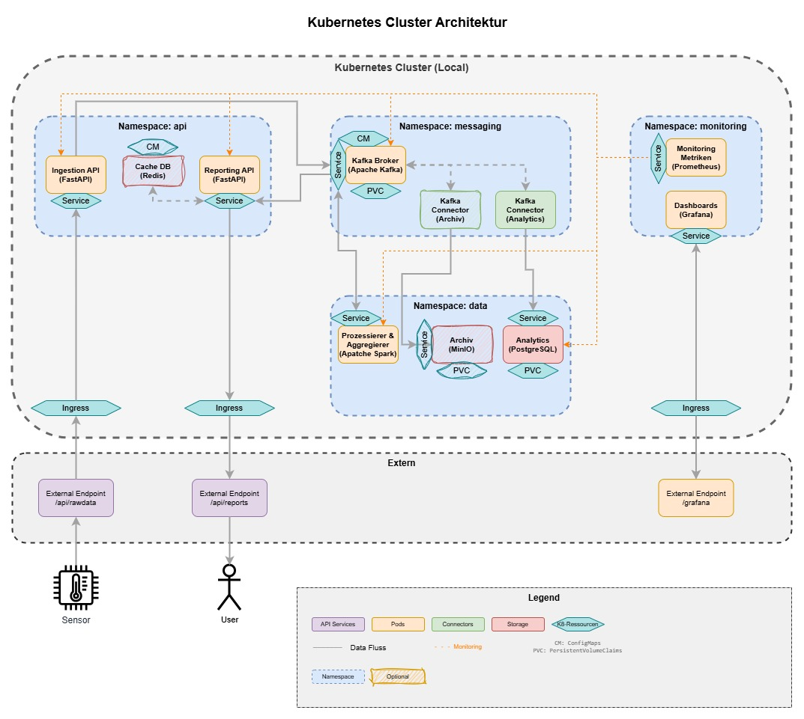

# DLMDWWDE02
Master Data Engineering - System, was in der Lage ist, kontinuierlich massive Datenmengen auf zunehmen, diese auf effiziente Weise zu speichern, zu prozessieren, zu aggregieren, und für die direkte Nutzung  in einer Echtzeit-Reporting Applikation zur Verfügung zu stellen

## Requirements
- Docker Engine
- DockerCLI (winget install Docker.DockerCLI)
- Kubectl (winget install -e --id Kubernetes.kubectl)
- Helm (winget install Helm.Helm)
- Kind (winget install Kubernetes.kind)

## Technologie Stack

### Container-Orchestrierung & Infrastructure
- **Kubernetes** - Container-Orchestrierung und Cluster-Management
- **Docker** - Containerisierung der Anwendungen
- **Helm** - Infrastructure as Code für Kubernetes

### Message Streaming & Data Ingestion
- **Apache Kafka** - Message Broker für Stream Processing ([Doku](https://kafka.apache.org/quickstart))
- **ClickHouse Connector** - Kafka Connect Sink Connector für ClickHouse ([Doku](https://clickhouse.com/docs/integrations/kafka/clickhouse-kafka-connect-sink))
- **MinIO/S3 Connector** - Kafka Connect Sink Connector für MinIO/S3 ([Doku](https://docs.min.io/enterprise/aistor-object-store/))
- **FastAPI** - API-Framework für Datenaufnahme ([Doku](https://fastapi.tiangolo.com/#installation))

### Batch Processing & Analytics
- **Apache Spark** - Distributed Computing für Batch-Prozessierung ([Doku](https://spark.apache.org/docs/latest/))
- **ClickHouse** - Column-oriented Database für Analytics ([Doku](https://clickhouse.com/docs/install/docker))
- **MinIO** - S3-kompatible Objektspeicherung für Datenarchivierung ([Doku](https://docs.min.io/docs/minio-kubernetes-quickstart-guide.html))

### Caching & Performance
- **Redis** - In-Memory Database für Caching ([Doku](https://redis.io/docs/latest/operate/kubernetes/deployment/quick-start/))

### Monitoring & Observability
- **Prometheus** - Metriken-Sammlung und Monitoring ([Doku](https://prometheus.io/docs/introduction/overview/))
- **Grafana** - Visualisierung und Dashboards ([Doku](https://grafana.com/docs/grafana/latest/getting-started/getting-started/))

### Programmiersprachen & Frameworks
- **Python** - Programmiersprache für Microservices und Data Processing ([Doku](https://docs.python.org/3.13/))

### Images
- **Python** - [python:3.13.9-alpine3.22](https://hub.docker.com/_/python)
    - **FastAPI** - mit [FastAPI](https://pypi.org/project/fastapi/)
- **Redis** - [redis:8.2.2-alpine3.22](https://hub.docker.com/_/redis)
- **Apache Kafka** - [apache/kafka:4.0.1](https://hub.docker.com/r/apache/kafka)
- **ClickHouse** - [clickhouse/clickhouse-server:latest](https://hub.docker.com/r/clickhouse/clickhouse-server)
- **ClickHouse Connector** - [ClickHouse Kafka Connect Sink](https://github.com/ClickHouse/clickhouse-kafka-connect)
- **MinIO** - [minio/minio:latest](https://hub.docker.com/r/minio/minio)
- **MinIO/S3 Connector** - [Confluent S3 Sink Connector](https://www.confluent.io/hub/confluentinc/kafka-connect-s3)
- **Apache Spark** - [apache/spark:3.5.7](https://hub.docker.com/r/apache/spark)
- **Prometheus** - [prom/prometheus:v3.7.1](https://hub.docker.com/r/prom/prometheus)
- **Grafana** - [grafana/grafana:main-ubuntu](https://hub.docker.com/r/grafana/grafana)

## Systemdesign & Architektur
Das Systemkonzept basiert auf einer Microservice-Architektur. Durch die Microarchitektur ist das System leichter wartbar und einzelne Komponenten lassen sich bei Bedarf einfach ersetzen. Als Datenquelle wird ein Python-Skript entwickelt, welches kontinuierlich Serverdaten simuliert und diese an das System weitergibt. Das System wird innerhalb eines Kubernetes(K8s)-Clusters betrieben. Hierdurch wird die Skalierbarkeit gewährleistet, innerhalb von K8s können einzelne Pods sowohl horizontal wie auch vertikal skaliert werden. Durch die horizontale Skalierung bzw. das Betreiben redundanter Pods kann die Verfügbarkeit des Systems gewährleistet werden. Das System wird im folgenden Datenfluss-Diagramms veranschaulicht.


Zuerst wird vom Python-Skript als Datenquelle ein http-Post erzeugt, welcher ein Datensatz darstellt. Jeder Datensatz besteht aus einem gemessenen Sensorwert und einem Timestamp. Der simulierte Sensor erzeugt kontinuierliche Daten, also einen stetigen Strom von Posts. Die eingehenden Daten werden über eine API erfasst, die als Schnittstelle zum Kubernetes‑Cluster fungiert. Diese API ist als FastAPI konzeptioniert. FastAPI bietet eine asynchrone Architektur und hohe Performance bei parallelisierten Requests sowie ein minimalistisches Design, das eine schlanke, typsichere Implementierung und automatische API‑Dokumentation ermöglicht. Die Daten werden von der API als Producer in ein Kafka-Cluster geschrieben.
Kafka fungiert als zentraler Message-Broker, der die Microservices entkoppelt. Die Daten werden in themenspezifischen Topics gepuffert. Durch Partitionen wird die Datensicherheit gewährleistet und durch Replikation der Kafka-Broker innerhalb des Clusters die Verfügbarkeit sichergestellt. Kafka ermöglicht damit eine zuverlässige asynchrone Kommunikation zwischen den verschiedenen Komponenten des Systems.
Die Verarbeitung erfolgt im Batch‑Modus. Die Rohdaten werden aus Apache Kafka gelesen, verarbeitet und aggregiert. Für die Aggregation wird der Mittelwert verwendet, da dieser das Messungenauigkeit reduziert und eine aussagekräftige Zusammenfassung kontinuierlicher Sensorwerte liefert. Als Windowing-Funktion werden Tumbling-Windows eingesetzt, dabei werden feste nicht überlappende Zeitfenster mit einer Zeitspanne von 10 Sekunden definiert. Das Vorgehen reduziert die Komplexität der Zustandsverwaltung und sorgt für reproduzierbare und vorhersehbare Antwort-zeiten bei der Auslieferung der Resultate. Die erzeugten Analyseergebnisse werden in einem separaten Kafka‑Topic Analytics-Data zurückgeschrieben, um eine entkoppelte Weiterverarbeitung und einfachen Konsum zu ermöglichen. Zur Umsetzung wird Apache Spark verwendet. Apache Spark ist eine für große Datenmengen optimierte Engine, welche problemlos in die bestehende Infrastruktur eingefügt werden kann. Die Verarbeitung ist auf Performance ausgelegt, sodass aggregierte Ergebnisse zeitnah für nachgelagerte Komponenten bereitgestellt werden.
Die Daten werden zur Einhaltung der Data‑Governance und für Langzeitanalysen archiviert. Die analysierten Daten werden von Kafka über einen dedizierten Kafka‑Connector in MinIO abgelegt. MinIO ist S3‑kompatibel, was die Integration in das System und eine mögliche Migration zu einem AWS S3-Storage erleichtert. Für interaktive Reports ist ein Datenarchiv jedoch nicht optimal. Deshalb wird eine speziell für Online Analytical Processing (OLAP) ausgelegte Analytics‑Datenbank (ClickHouse) über einen separaten Kafka‑Connector befüllt, sodass analytische Abfragen auf großen Datenmengen performant ausgeführt werden können. Die Reporting‑API verarbeitet die Anfragen der Reporting-Applikation und fragt die Daten bei ClickHouse ab. Zusätzlich wird durch ein Redis‑Cache die Antwortzeiten bei häufigen Abfragen reduziert.


In dieser Abbildung wird die Architektur innerhalb von K8s veranschaulicht. Wie zu sehen ist, werden die verschieden Microservices als einzelne Pods realisiert. Zusätzlich werden die einzelnen Aufgabengebiete zu Namespaces zusammengefasst. Durch strenge Isolationsrichtlinien innerhalb des Clusters wird der Datenschutz gestärkt. Zudem gibt es nur zwei dedizierte APIs, welche mit externen Systemen kommunizieren können. Das innere des Systems ist somit abgeschottet. Die Datensicherheit kann durch verschiedene Faktoren sichergestellt werden zum einen kann die externe Kommunikation über den K8s-Ingress und die API auf https beschränkt werden und eine Authentifizierungsmöglichkeit bereitgestellt werden. Zum anderen kann innerhalb des Clusters in Kafka eine SSL/TSL- oder auch eine SASL-Verschlüsselung konfiguriert werden, hierdurch wird die interne Kommunikation zwischen den Pods und Kafka abgesichert.
Desweitern wird ein Monitoring durch Prometheus und Grafana eingeplant. Prometheus sammelt Metriken der kritischen K8s-Pods. Diese können durch Grafana dargestellt werden. Durch das Monitoring werden die Zustände der Pods sichtbar. Dabei können verschiedene Kennzahlen von Prometheus erfasst werden, unter anderem die Auslastung des Pods. Durch das Monitoring lässt sich die Einhaltung von Governance‑Anforderungen überprüfen. Auffälligkeiten werden so schneller erkannt, um Gegenmaßnahmen zu ermöglichen. Zudem lässt sich das Monitoring bei Bedarf auch durch ein Alerting erweitern welches beispielsweise eine Bereitschaft benachrichtigt.

### K8s-Ressourcen


## Inbetriebnahme

### Voraussetzungen installieren
```powershell
winget install Helm.Helm
winget install Kubernetes.kind
winget install Docker.DockerCLI
Set-ExecutionPolicy -ExecutionPolicy Unrestricted -Scope CurrentUser
```

### System deployen
```powershell
# Kind Cluster erstellen
kind create cluster --config kind-config.yaml --name system-cluster

# Cluster-Verbindung prüfen
kubectl cluster-info --context kind-system-cluster

# System mit Helm deployen
cd helm-charts\system-cluster
helm install system-cluster . --namespace default --create-namespace --wait
```

### Monitoring deployen
```powershell
# Prometheus mit allen Exportern deployen
cd monitoring
.\deploy-monitoring.ps1

# Prometheus UI öffnen
kubectl port-forward -n monitoring svc/prometheus 9090:9090
# Browser: http://localhost:9090
```

Siehe auch:
- **Monitoring Setup**: `monitoring/README.md`
- **Quick Start**: `monitoring/QUICKSTART.md`
- **PromQL Queries**: `monitoring/prometheus-queries.md`
