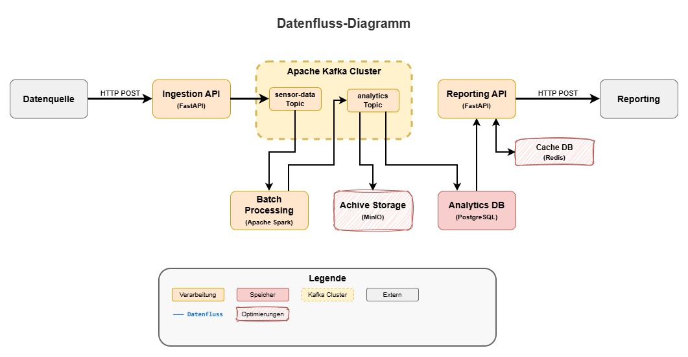
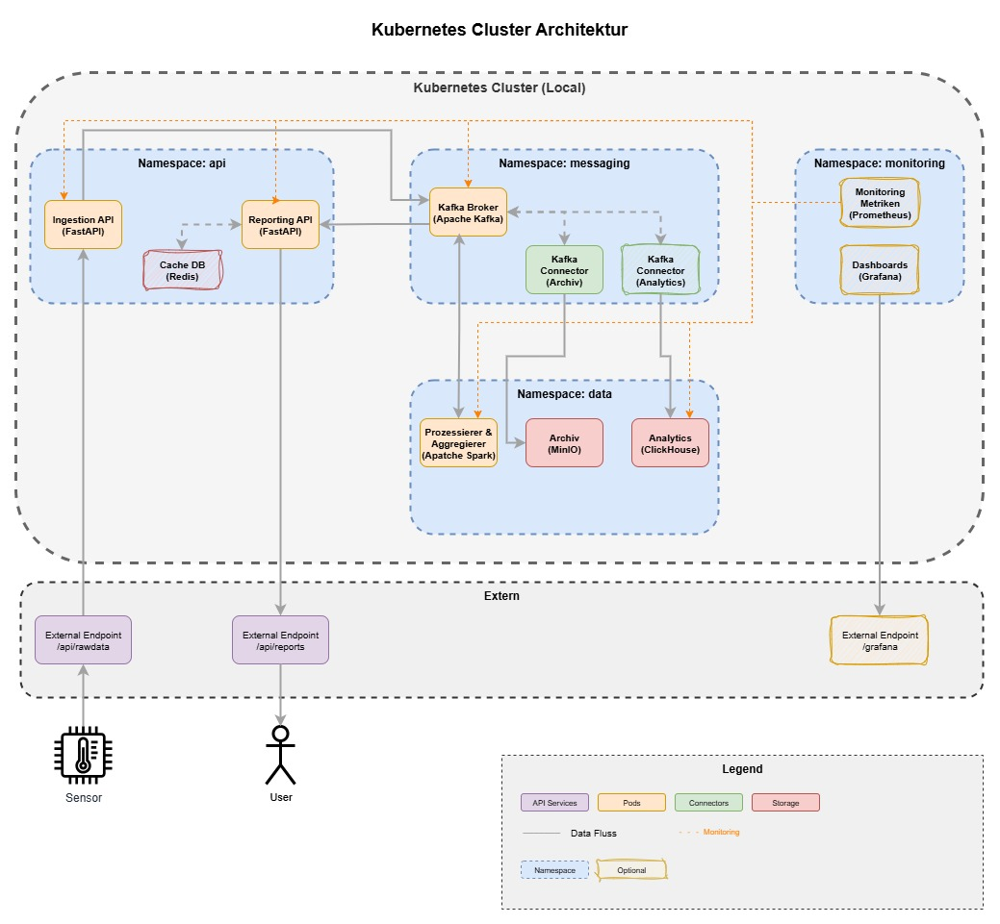

# DLMDWWDE02
Master Data Engineering - System, was in der Lage ist, kontinuierlich massive Datenmengen auf zunehmen, diese auf effiziente Weise zu speichern, zu prozessieren, zu aggregieren, und für die direkte Nutzung  in einer Echtzeit-Reporting Applikation zur Verfügung zu stellen

## Requirements
- Docker Engine
- DockerCLI (winget install Docker.DockerCLI)
- Kubectl (winget install -e --id Kubernetes.kubectl)
- Helm (winget install Helm.Helm)
- kubectl

## Technologie Stack

### Container-Orchestrierung & Infrastructure
- **Kubernetes** - Container-Orchestrierung und Cluster-Management
- **Docker** - Containerisierung der Anwendungen
- **Helm** - Infrastructure as Code für Kubernetes

### Message Streaming & Data Ingestion
- **Apache Kafka** - Message Broker für Stream Processing ([Doku](https://kafka.apache.org/quickstart))
- **ClickHouse Connector** - Kafka Connect Sink Connector für ClickHouse ([Doku](https://clickhouse.com/docs/integrations/kafka/clickhouse-kafka-connect-sink))
- **MinIO/S3 Connector** - Kafka Connect Sink Connector für MinIO/S3 ([Doku](https://docs.min.io/enterprise/aistor-object-store/))
- **FastAPI** - API-Framework für Datenaufnahme ([Doku](https://fastapi.tiangolo.com/#installation))

### Batch Processing & Analytics
- **Apache Spark** - Distributed Computing für Batch-Prozessierung ([Doku](https://spark.apache.org/docs/latest/))
- **ClickHouse** - Column-oriented Database für Analytics ([Doku](https://clickhouse.com/docs/install/docker))
- **MinIO** - S3-kompatible Objektspeicherung für Datenarchivierung ([Doku](https://docs.min.io/docs/minio-kubernetes-quickstart-guide.html))

### Caching & Performance
- **Redis** - In-Memory Database für Caching ([Doku](https://redis.io/docs/latest/operate/kubernetes/deployment/quick-start/))

### Monitoring & Observability
- **Prometheus** - Metriken-Sammlung und Monitoring ([Doku](https://prometheus.io/docs/introduction/overview/))
- **Grafana** - Visualisierung und Dashboards ([Doku](https://grafana.com/docs/grafana/latest/getting-started/getting-started/))

### Programmiersprachen & Frameworks
- **Python** - Programmiersprache für Microservices und Data Processing ([Doku](https://docs.python.org/3.13/))

### Images
- **Python** - [python:3.13.9-alpine3.22](https://hub.docker.com/_/python)
    - **FastAPI** - mit [FastAPI](https://pypi.org/project/fastapi/)
- **Redis** - [redis:8.2.2-alpine3.22](https://hub.docker.com/_/redis)
- **Apache Kafka** - [apache/kafka:4.0.1](https://hub.docker.com/r/apache/kafka)
- **ClickHouse** - [clickhouse/clickhouse-server:latest](https://hub.docker.com/r/clickhouse/clickhouse-server)
- **ClickHouse Connector** - [ClickHouse Kafka Connect Sink](https://github.com/ClickHouse/clickhouse-kafka-connect)
- **MinIO** - [minio/minio:latest](https://hub.docker.com/r/minio/minio)
- **MinIO/S3 Connector** - [Confluent S3 Sink Connector](https://www.confluent.io/hub/confluentinc/kafka-connect-s3)
- **Apache Spark** - [apache/spark:3.5.7](https://hub.docker.com/r/apache/spark)
- **Prometheus** - [prom/prometheus:v3.7.1](https://hub.docker.com/r/prom/prometheus)
- **Grafana** - [grafana/grafana:main-ubuntu](https://hub.docker.com/r/grafana/grafana)

## Systemdesign & Architektur

Das entwickelte Data Engineering System basiert auf einer modernen Microservice-Architektur, die darauf ausgelegt ist, kontinuierlich massive Datenmengen aufzunehmen, zu verarbeiten und für Echtzeit-Reporting bereitzustellen.

Die **Data Ingestion** wird durch eine spezialisierte Ingestion API auf Basis von FastAPI realisiert, welche REST API Endpunkte für externe Datenquellen bereitstellt. Diese API übernimmt nicht nur die Datenaufnahme, sondern führt auch eine erste Validierung und Vorverarbeitung der eingehenden Daten durch, bevor diese zur weiteren Stream-Verarbeitung an Apache Kafka weitergeleitet werden. Durch die Implementierung als Kubernetes ReplicaSet kann dieser Service horizontal skaliert werden, um auch bei hohem Datenaufkommen eine zuverlässige Performance zu gewährleisten.

Für die **Datenvorprozessierung und Aggregation** kommt Apache Spark als zentrale Batch-Processing Engine zum Einsatz. Dabei koordiniert der Spark Driver das Job-Management und die Ressourcenverteilung, während die Spark Executors die eigentliche parallele Datenverarbeitung durchführen. Durch den Einsatz von Structured Streaming wird eine kontinuierliche Batch-Verarbeitung ermöglicht, die mit automatischer Partitionierung und Load Balancing für optimale Performance sorgt.

Die **Zuverlässigkeit, Skalierbarkeit und Wartbarkeit** des Systems werden durch verschiedene bewährte Technologien und Methoden sichergestellt. Kubernetes bildet dabei das Fundament für die Zuverlässigkeit, indem es automatische Neustarts fehlgeschlagener Pods durchführt, während Apache Kafka durch konfigurierbare Replikationsfaktoren für Datenredundanz sorgt. Persistent Volumes gewährleisten die Datenpersistierung über Pod-Neustarts hinweg, und umfassende Health Checks mit Liveness- und Readiness-Probes überwachen kontinuierlich den Zustand aller Services. Die Skalierbarkeit wird durch den Horizontal Pod Autoscaler (HPA) erreicht, der automatisch basierend auf CPU- und Memory-Verbrauch skaliert, ergänzt durch Kafka Partitioning für Parallelisierung, dynamische Spark Worker-Skalierung und ClickHouse Cluster für die Verarbeitung großer Datenmengen. Für die Wartbarkeit sorgen Helm Charts als Infrastructure as Code Lösung für reproduzierbare Deployments, GitOps für die Versionskontrolle aller Konfigurationen, umfassendes Monitoring mit Prometheus und Grafana sowie eine Microservice-Architektur mit lose gekoppelten, unabhängig deploybare Services.

**Datenschutz, Datensicherheit und Data Governance** werden durch ein mehrstufiges Konzept gewährleistet. Der Datenschutz wird durch Namespace-Isolation zur Trennung der Microservices, Role-Based Access Control (RBAC) in Kubernetes und Network Policies zur Einschränkung der Pod-zu-Pod Kommunikation sichergestellt. Die Datensicherheit basiert auf TLS-Verschlüsselung für die gesamte Datenübertragung, Kubernetes Secrets Management für sichere Credential-Verwaltung, Server-side Encryption in MinIO für Objektspeicher und Database-level Access Control in ClickHouse. Für Data Governance sorgen eine zentrale Schema Registry für Kafka, umfassende Data Lineage Tracking zur Nachverfolgung des Datenflusses, Audit Logging aller Datenoperationen und automatisierte Retention Policies für die zeitgesteuerte Datenlöschung.

**Datenschutz, Datensicherheit und Data Governance** werden entsprechend der implementierten Kubernetes-Architektur umgesetzt.

**Datenschutz** wird auf Kubernetes-Ebene durch Namespace-basierte Isolation implementiert. Die Architektur trennt Services in dedizierte Namespaces: `api` für die FastAPI Services (Ingestion API, Reporting API), `messaging` für Kafka, `data` für Speicher-Services (ClickHouse, MinIO, Spark Driver) und `monitoring` für Prometheus und Grafana. Diese Segmentierung schafft Isolation zwischen den verschiedenen Funktionsbereichen und ermöglicht granulare Zugriffskontrolle.

Die **Datensicherheit** konzentriert sich auf die tatsächlich implementierten Komponenten der Architektur. Kubernetes bietet grundlegende Sicherheit durch Namespace-Isolation und Pod-zu-Pod Kommunikationskontrolle. Die verwendeten Services unterstützen verschiedene Sicherheitsfeatures: Apache Kafka bietet optionale SSL/TLS-Verschlüsselung für Client-Verbindungen ([Kafka Security Documentation](https://kafka.apache.org/documentation/#security)), MinIO unterstützt Server-side Encryption für gespeicherte Objekte, und ClickHouse ermöglicht Benutzer-basierte Zugriffskontrolle auf Database-Level.

Für **Data Governance** sind grundlegende Tracking-Mechanismen durch die Service-Architektur vorgesehen. Der Datenfluss ist klar definiert: Externe Daten gelangen über die Ingestion API zu Kafka, werden durch dedizierte Kafka Connectors zu ClickHouse (Analytics) und MinIO (Archiv) weitergeleitet, und der Spark Driver verarbeitet Daten aus Kafka für weitere Aggregationen. Redis fungiert als Cache für die Reporting API und reduziert die Belastung auf die primären Datenbanken.

**Monitoring und Observability** werden durch die integrierte Prometheus-Grafana Kombination realisiert. Prometheus sammelt Metriken von allen Services (Ingestion API, Kafka, Spark Driver, ClickHouse) und ermöglicht die Überwachung der System-Performance. Grafana visualisiert diese Metriken über externe Endpunkte und bietet Dashboards für das Monitoring der Datenverarbeitungs-Pipeline.

**Architektonische Sicherheitsaspekte** basieren auf der Microservice-Trennung durch Kubernetes Namespaces. Die Kafka Connectors fungieren als dedizierte Brücken zwischen Kafka und den Speicher-Services, wodurch direkte Service-zu-Service Abhängigkeiten minimiert werden. Externe Zugriffe sind nur über definierte Endpunkte möglich: `/api/rawdata` für Datenaufnahme, `/api/reports` für Reporting und `/grafana` für Monitoring-Dashboards.

Die **Docker Images** basieren größtenteils auf offiziellen Images von Docker Hub, werden jedoch für spezifische Anforderungen modifiziert. Während die meisten Services wie Redis, Apache Kafka, ClickHouse, MinIO, Prometheus und Grafana unverändert eingesetzt werden können, erfordern einige Komponenten Anpassungen. So werden für die FastAPI Services Custom Dockerfiles erstellt, die auf dem Python Alpine Image basieren und spezifische Dependencies enthalten. Kafka Connect benötigt Plugin-Installationen für die ClickHouse und S3 Connectors, und die Spark Images werden mit Custom Configurations für die ClickHouse Integration ausgestattet.

Für die **Systemtests** werden vielfältige Testdaten verwendet, um verschiedene Szenarien abzudecken. Dazu gehören synthetische IoT-Daten mit Sensor-Readings und Timestamps, E-Commerce-Transaktionsdaten mit Order-, Payment- und Customer-Events, sowie Application Logs mit verschiedenen Log-Levels und CSV/JSON Files für Bulk-Processing Tests. Die Testdaten umfassen dabei ein Volume von 1-10GB pro Szenario in verschiedenen Formaten (JSON, CSV, Avro), mit einer Velocity von 1000-10000 Events pro Sekunde für Load Tests und Schema Evolution Tests mit sich ändernden Datenstrukturen.

Die **Aggregations- und Windowing-Funktionen** werden sowohl in Spark Structured Streaming als auch in ClickHouse implementiert. Spark bietet dabei Tumbling Windows für feste Zeitfenster (5 Minuten, 15 Minuten, 1 Stunde), Sliding Windows für überlappende kontinuierliche Aggregation und Session Windows für event-basierte User-Sessions. Die Aggregationsfunktionen umfassen Standard-Operationen wie COUNT, SUM, AVG für Basis-Aggregationen, MIN und MAX für Extremwerte pro Zeitfenster, PERCENTILE für quantil-basierte Analysen, DISTINCT COUNT für Unique-Zählungen sowie benutzerdefinierte UDAFs (User Defined Aggregate Functions). ClickHouse ergänzt dies durch Materialized Views für kontinuierliche Real-time Aggregation, Multi-level Roll-ups für hierarchische Aggregation von Minuten über Stunden zu Tagen und spezielle Approximate Functions wie uniqCombined und quantileTDigest für Performance-optimierte Berechnungen.

## Architektur
### Datenfluss

### K8s-Architektur

