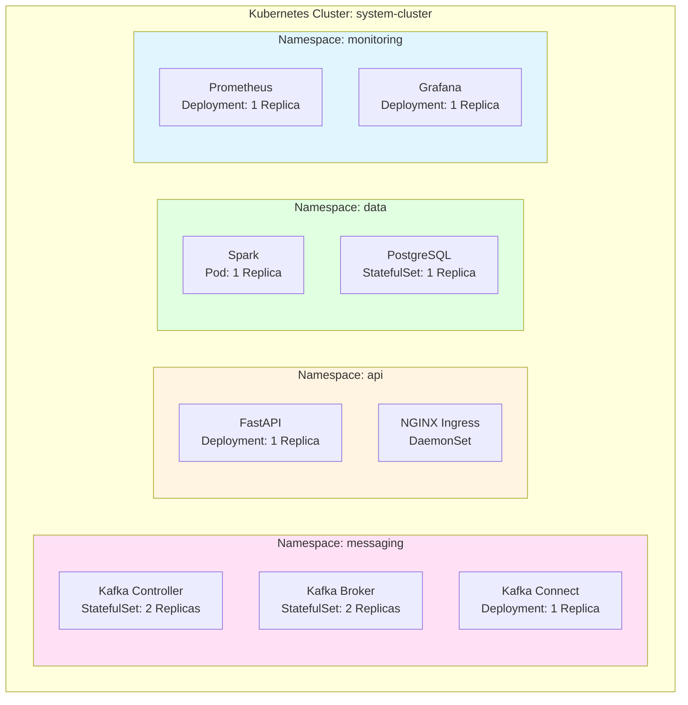
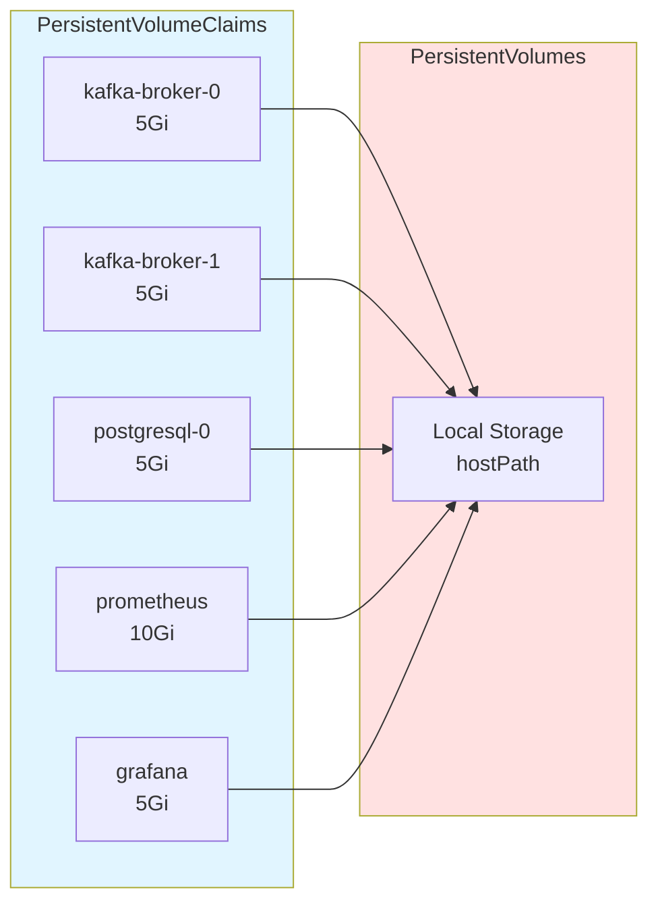
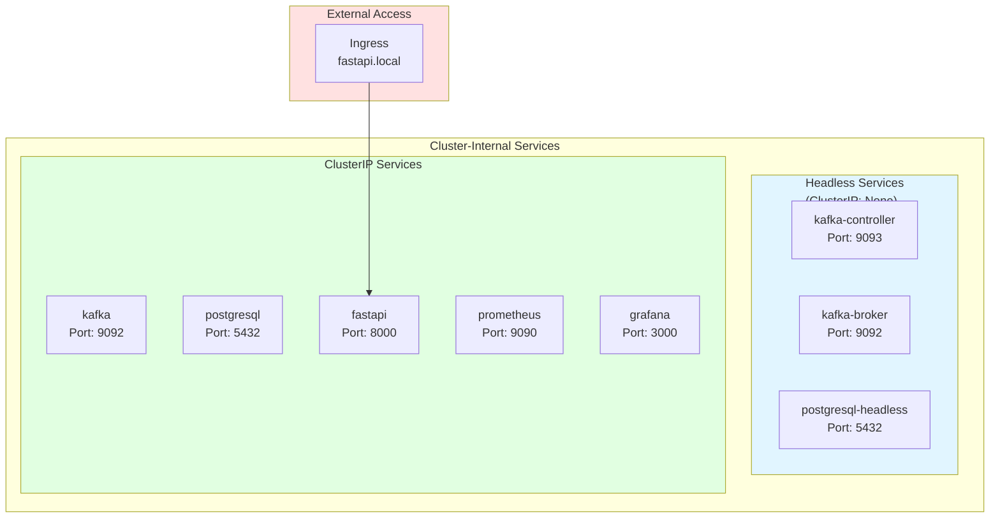
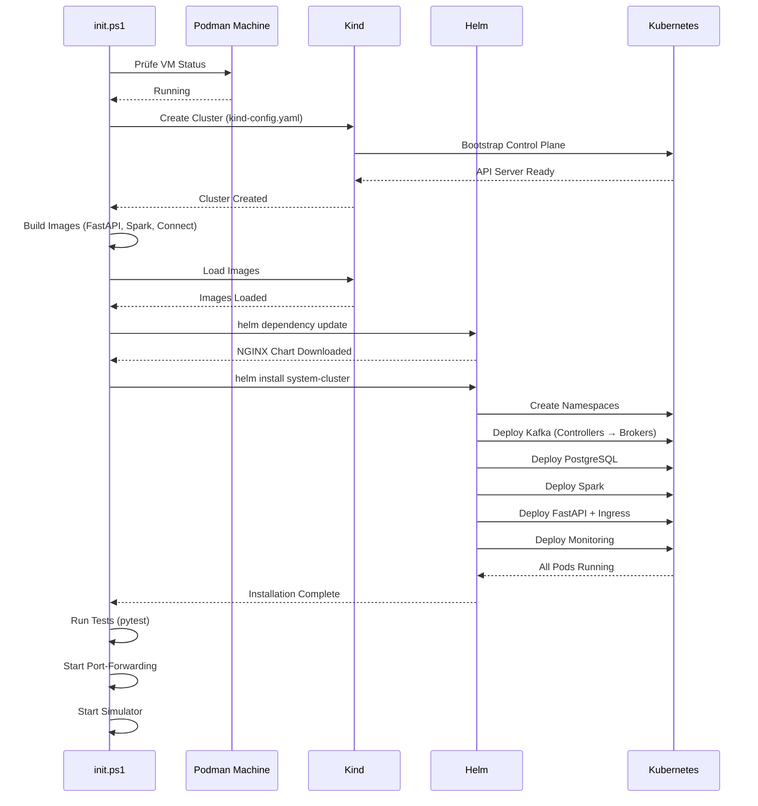

# 01 - Infrastruktur

## Übersicht

Die Infrastruktur des Data Engineering Systems basiert auf **Kubernetes (Kind)** mit **Podman** als Container-Runtime. Das System nutzt **Helm Charts** für deklarative Deployment-Konfiguration und implementiert strikte **Namespace-Isolation** für Microservices.


## Kubernetes Cluster

### Kind (Kubernetes in Docker)

**Kind** wird verwendet, um einen lokalen Kubernetes-Cluster in Podman-Containern zu betreiben.

**Cluster-Konfiguration:** [`kind-config.yaml`](../kind-config.yaml)

```yaml
kind: Cluster
apiVersion: kind.x-k8s.io/v1alpha4
name: system-cluster
nodes:
- role: control-plane
  kubeadmConfigPatches:
  - |
    kind: InitConfiguration
    nodeRegistration:
      kubeletExtraArgs:
        node-labels: "ingress-ready=true"
  extraPortMappings:
  - containerPort: 80
    hostPort: 80
  - containerPort: 443
    hostPort: 443
```

**Wichtige Merkmale:**
- **Single-Node Cluster** (Control Plane + Worker kombiniert)
- **Ingress-Ready Label** für NGINX Ingress Controller
- **Port-Mapping** 80/443 für externe HTTP/HTTPS-Zugriffe
- **Cluster-Name:** `system-cluster`

### Podman Integration

**Warum Podman statt Docker?**
- Rootless Container-Ausführung (bessere Sicherheit)
- Daemonless Architektur (geringerer Ressourcen-Overhead)
- Kompatibel mit Docker CLI
- Native Windows-Integration via WSL2

**Podman Machine Setup:**
```powershell
# VM erstellen (falls nicht vorhanden)
podman machine init

# VM starten
podman machine start

# Status prüfen
podman machine list
```

**Kind mit Podman nutzen:**
```powershell
$env:KIND_EXPERIMENTAL_PROVIDER = "podman"
kind create cluster --config kind-config.yaml --name system-cluster
```

## Namespace-Architektur

Das System nutzt **4 dedizierte Namespaces** für strikte Isolation:



### Namespace-Definitionen

**Template:** [`helm-charts/system-cluster/templates/namespaces.yaml`](../helm-charts/system-cluster/templates/namespaces.yaml)

| Namespace | Zweck | Komponenten |
|-----------|-------|-------------|
| `messaging` | Event Streaming & Integration | Kafka Controller, Kafka Broker, Kafka Connect |
| `api` | Externe Schnittstellen | FastAPI, NGINX Ingress Controller |
| `data` | Datenverarbeitung & Speicherung | Apache Spark, PostgreSQL |
| `monitoring` | Observability | Prometheus, Grafana |

### Service Discovery (Cluster DNS)

Kubernetes nutzt CoreDNS für Service-Auflösung. Format:

```
<service-name>.<namespace>.svc.cluster.local
```

**Beispiele:**
```bash
# Kafka Broker (von jedem Namespace aus)
kafka.messaging.svc.cluster.local:9092

# PostgreSQL (von api/data Namespace)
postgresql.data.svc.cluster.local:5432

# Prometheus (von monitoring Namespace)
prometheus.monitoring.svc.cluster.local:9090

# FastAPI (intern)
fastapi.api.svc.cluster.local:8000
```

**Namespace-übergreifende Kommunikation:**
- ✅ **Erlaubt** (keine Network Policies konfiguriert)
- ⚠️ **Produktion:** Network Policies sollten Traffic einschränken

## Helm Chart Struktur

### Chart-Übersicht

**Chart-Root:** [`helm-charts/system-cluster/`](../helm-charts/system-cluster/)

```
helm-charts/system-cluster/
├── Chart.yaml              # Chart Metadata & Dependencies
├── values.yaml             # Konfigurationswerte
├── charts/                 # Dependency Charts (NGINX Ingress)
├── templates/              # Kubernetes Manifests
│   ├── namespaces.yaml     # Namespace-Definitionen
│   ├── kafka.yaml          # Kafka Controller + Broker
│   ├── postgresql.yaml     # PostgreSQL StatefulSet
│   ├── postgresql-connect.yaml  # Kafka Connect
│   ├── spark.yaml          # Spark Pod
│   ├── fastapi.yaml        # FastAPI Deployment + Ingress
│   ├── prometheus.yaml     # Prometheus Deployment
│   └── grafana.yaml        # Grafana Deployment
└── grafana/                # Grafana Dashboard JSONs
    ├── cluster-resources-dashboard.json
    ├── api-namespace-dashboard.json
    ├── messaging-namespace-dashboard.json
    ├── data-namespace-dashboard.json
    └── monitoring-namespace-dashboard.json
```

### Chart.yaml

```yaml
apiVersion: v2
name: system-cluster
description: Data Engineering System - Kubernetes Cluster
type: application
version: 1.0.0
appVersion: "1.0"

dependencies:
  - name: ingress-nginx
    version: 4.11.3
    repository: https://kubernetes.github.io/ingress-nginx
```

**Dependencies:**
- **NGINX Ingress Controller** 4.11.3 (automatisch via `helm dependency update`)

### Values.yaml Struktur

**Datei:** [`helm-charts/system-cluster/values.yaml`](../helm-charts/system-cluster/values.yaml)

**Hauptkategorien:**
```yaml
# Globale Einstellungen
replicaCount: 1
imagePullSecrets: []

# Kafka (messaging namespace)
kafka:
  namespace: messaging
  image: apache/kafka:4.1.0
  controller: {...}
  broker: {...}

# FastAPI (api namespace)
fastapi:
  namespace: api
  image: localhost/fastapi:latest
  pullPolicy: Never
  env: {...}
  ingress: {...}

# Spark (data namespace)
spark:
  namespace: data
  image: localhost/spark:latest
  env: {...}

# PostgreSQL (data namespace)
postgresql:
  namespace: data
  image: postgres:16-alpine
  database: sensordata
  env: {...}

# Kafka Connect (messaging namespace)
kafka-connect:
  namespace: messaging
  image: localhost/postgres-kafka-connector:latest
  env: {...}

# Prometheus (monitoring namespace)
prometheus:
  namespace: monitoring
  image: prom/prometheus:v3.7.1
  storage: {...}

# Grafana (monitoring namespace)
grafana:
  namespace: monitoring
  image: grafana/grafana:11.4.0
  adminUser: admin
  adminPassword: admin

# NGINX Ingress (dependency)
ingress-nginx:
  enabled: true
  controller: {...}
```

### Template-Patterns

**Namespace-Injection:**
```yaml
apiVersion: v1
kind: Service
metadata:
  name: kafka
  namespace: {{ .Values.kafka.namespace }}
```

**Environment-Variable-Iteration:**
```yaml
env:
{{- range $key, $value := .Values.kafka.broker.env }}
- name: {{ $key }}
  value: {{ $value | quote }}
{{- end }}
```

**Conditional Rendering:**
```yaml
{{- if .Values.fastapi.ingress.enabled }}
apiVersion: networking.k8s.io/v1
kind: Ingress
# ...
{{- end }}
```

## Ressourcen-Management

### Kubernetes Ressourcen-Übersicht


### StatefulSets vs. Deployments

**StatefulSets** (stabile Identität + persistentes Storage):
- Kafka Controller (`kafka-controller-0`, `kafka-controller-1`)
- Kafka Broker (`kafka-broker-0`, `kafka-broker-1`)
- PostgreSQL (`postgresql-0`)

**Deployments** (stateless, austauschbare Pods):
- FastAPI
- Kafka Connect
- Prometheus
- Grafana
- NGINX Ingress Controller

**Pods** (einzelne Instanz ohne Controller):
- Spark (bewusst als Pod für einfache Neustarts)

### PersistentVolumes



**Storage-Anforderungen:**
| Component | Size | Storage Class | Zweck |
|-----------|------|---------------|-------|
| Kafka Broker (pro Replica) | 5Gi | standard | Topic Partitions & Logs |
| PostgreSQL | 5Gi | standard | Analytics-Daten |
| Prometheus | 10Gi | standard | Metriken (15 Tage Retention) |
| Grafana | 5Gi | standard | Dashboards & Annotations |

**Gesamt:** ~35 GB

**Kind Default StorageClass:**
- **Name:** `standard`
- **Provisioner:** `rancher.io/local-path`
- **VolumeBindingMode:** `WaitForFirstConsumer`
- **Backing Storage:** Host-Verzeichnis im Kind-Container

### Ressourcen-Limits

**CPU & Memory Konfiguration:**

```yaml
# Beispiel: Kafka Broker (values.yaml)
resources:
  requests:
    cpu: "1000m"      # 1 CPU Core garantiert
    memory: "2Gi"     # 2 GB RAM garantiert
  limits:
    cpu: "2000m"      # Max 2 CPU Cores
    memory: "4Gi"     # Max 4 GB RAM
```

**Gesamtübersicht:**

| Component | CPU Request | Memory Request | CPU Limit | Memory Limit |
|-----------|-------------|----------------|-----------|--------------|
| Kafka Controller (pro Pod) | 500m | 1Gi | 1000m | 2Gi |
| Kafka Broker (pro Pod) | 1000m | 2Gi | 2000m | 4Gi |
| Kafka Connect | 500m | 1Gi | 1000m | 3Gi |
| Spark | 1000m | 2Gi | 2000m | 4Gi |
| PostgreSQL | 250m | 512Mi | 500m | 1Gi |
| FastAPI | 250m | 256Mi | 500m | 512Mi |
| Prometheus | 500m | 1Gi | 2000m | 4Gi |
| Grafana | 250m | 512Mi | 1000m | 2Gi |
| NGINX Ingress | 100m | 128Mi | 200m | 256Mi |

**Gesamt (Requests):** ~6 CPU Cores, ~11 GB RAM
**Minimum Host-Anforderung:** 8 CPU Cores, 16 GB RAM

## Services & Networking

### Service-Typen



**Service-Typen erklärt:**

1. **Headless Service** (`ClusterIP: None`)
   - **Zweck:** DNS-basierte Pod-Discovery für StatefulSets
   - **Beispiel:** `kafka-broker-0.kafka-broker.messaging.svc.cluster.local`
   - **Verwendet von:** Kafka Controller (Quorum Voters), Kafka Broker (Inter-Broker)

2. **ClusterIP Service**
   - **Zweck:** Load-Balancing über mehrere Pods
   - **Beispiel:** `kafka.messaging.svc.cluster.local:9092` → Round-Robin zu allen Brokern
   - **Verwendet von:** FastAPI, Spark (Kafka Clients)

3. **Ingress**
   - **Zweck:** HTTP/HTTPS Zugriff von außerhalb des Clusters
   - **Beispiel:** `http://fastapi.local` → FastAPI Service
   - **Controller:** NGINX Ingress

### Port-Übersicht

| Service | Namespace | Port | Protokoll | Zweck |
|---------|-----------|------|-----------|-------|
| `kafka-controller` | messaging | 9093 | TCP | KRaft Quorum Communication |
| `kafka-broker` | messaging | 9092 | TCP | Kafka Client Connections |
| `kafka-broker` | messaging | 19092 | TCP | Kafka Inter-Broker |
| `kafka-connect` | messaging | 8083 | HTTP | Kafka Connect REST API |
| `postgresql` | data | 5432 | TCP | PostgreSQL Database |
| `fastapi` | api | 8000 | HTTP | FastAPI REST API |
| `prometheus` | monitoring | 9090 | HTTP | Prometheus Web UI & API |
| `grafana` | monitoring | 3000 | HTTP | Grafana Web UI |

## Image-Management

### Lokale Images (Custom-Built)

**Verwendete Images:**
- `localhost/fastapi:latest` - FastAPI Ingestion API
- `localhost/spark:latest` - Apache Spark Streaming
- `localhost/postgres-kafka-connector:latest` - Kafka Connect mit JDBC Connector

**Build-Prozess:**
```powershell
# 1. Mit Podman bauen
podman build -f Dockerfile.fastapi -t localhost/fastapi:latest .

# 2. Als tar exportieren
podman save localhost/fastapi:latest -o fastapi.tar

# 3. In Kind-Cluster laden
kind load image-archive fastapi.tar --name system-cluster

# 4. Aufräumen
rm fastapi.tar
```

**imagePullPolicy:**
```yaml
# Für lokale Images IMMER "Never" setzen
image: localhost/fastapi:latest
imagePullPolicy: Never
```

**Warum `Never`?**
- Verhindert Docker Hub Pull-Versuche
- Erzwingt Nutzung des lokal geladenen Images
- Schnelleres Deployment (kein Registry-Lookup)

### Public Images (Docker Hub)

**Verwendete Images:**
- `apache/kafka:4.1.0` - Kafka KRaft Mode
- `postgres:16-alpine` - PostgreSQL Datenbank
- `prom/prometheus:v3.7.1` - Prometheus Monitoring
- `grafana/grafana:11.4.0` - Grafana Dashboards
- NGINX Ingress (via Helm Dependency)

**imagePullPolicy:**
```yaml
# Für public images Standard (IfNotPresent)
image: apache/kafka:4.1.0
imagePullPolicy: IfNotPresent
```

## Ingress-Konfiguration

### NGINX Ingress Controller

**Helm Dependency:** [`helm-charts/system-cluster/Chart.yaml`](../helm-charts/system-cluster/Chart.yaml)

```yaml
dependencies:
  - name: ingress-nginx
    version: 4.11.3
    repository: https://kubernetes.github.io/ingress-nginx
```

**Konfiguration in values.yaml:**
```yaml
ingress-nginx:
  enabled: true
  controller:
    hostPort:
      enabled: true
    service:
      type: NodePort
      nodePorts:
        http: 30080
        https: 30443
    admissionWebhooks:
      enabled: false  # Deaktiviert für lokale Entwicklung
    metrics:
      enabled: true
      serviceMonitor:
        enabled: true
```

**Port-Mapping (via kind-config.yaml):**
```yaml
extraPortMappings:
  - containerPort: 80
    hostPort: 80
  - containerPort: 443
    hostPort: 443
```

**Ergebnis:**
- `http://localhost:80` → NGINX Ingress Controller → FastAPI
- Hostname-basiertes Routing via `Host` Header

### FastAPI Ingress

**Template:** [`helm-charts/system-cluster/templates/fastapi.yaml`](../helm-charts/system-cluster/templates/fastapi.yaml)

```yaml
apiVersion: networking.k8s.io/v1
kind: Ingress
metadata:
  name: fastapi-ingress
  namespace: {{ .Values.fastapi.namespace }}
  annotations:
    nginx.ingress.kubernetes.io/rewrite-target: /
spec:
  ingressClassName: nginx
  rules:
  - host: {{ .Values.fastapi.ingress.host }}
    http:
      paths:
      - path: /
        pathType: Prefix
        backend:
          service:
            name: fastapi
            port:
              number: 8000
```

**Zugriff:**
```powershell
# Mit Host-Header
curl -H "Host: fastapi.local" http://localhost/health

# Oder direkt via Port-Forwarding
kubectl port-forward -n api svc/fastapi 8000:8000
curl http://localhost:8000/health
```

## Cluster-Initialisierung

### Startup-Reihenfolge



**Kritische Abhängigkeiten:**
1. **Podman VM** muss laufen (für Kind)
2. **Kafka Controller** müssen vor Brokers ready sein (Quorum)
3. **Kafka Broker** müssen vor Clients (FastAPI, Spark) ready sein
4. **PostgreSQL** muss vor Kafka Connect ready sein
5. **Prometheus** muss vor Grafana ready sein (Datasource)

### Health Checks

**Liveness & Readiness Probes:**

```yaml
# FastAPI Beispiel
livenessProbe:
  httpGet:
    path: /health
    port: 8000
  initialDelaySeconds: 30
  periodSeconds: 10

readinessProbe:
  httpGet:
    path: /ready
    port: 8000
  initialDelaySeconds: 10
  periodSeconds: 5
```

**Zweck:**
- **Liveness:** Kubernetes startet Pod neu bei Fehler
- **Readiness:** Kubernetes routet Traffic erst wenn ready

## Troubleshooting

### Häufige Infrastruktur-Probleme

**Problem: Cluster startet nicht**
```powershell
# Prüfe Kind Cluster
kind get clusters

# Logs anschauen
kind export logs --name system-cluster

# Cluster löschen & neu erstellen
kind delete cluster --name system-cluster
.\init.ps1
```

**Problem: Pods starten nicht (ImagePullBackOff)**
```powershell
# Prüfe Image in Kind
podman exec system-cluster-control-plane crictl images | grep fastapi

# Image neu laden
kind load image-archive fastapi.tar --name system-cluster

# Pod neu starten
kubectl delete pod -n api -l app=fastapi
```

**Problem: Namespace nicht gefunden**
```powershell
# Alle Namespaces auflisten
kubectl get namespaces

# Helm Release prüfen
helm list -A

# Helm Installation wiederholen
helm upgrade system-cluster helm-charts/system-cluster -n default --wait
```

**Problem: Service nicht erreichbar**
```powershell
# Service Status
kubectl get svc -A

# Endpoints prüfen
kubectl get endpoints -A

# DNS-Auflösung testen
kubectl run -it --rm debug --image=busybox --restart=Never -- nslookup kafka.messaging.svc.cluster.local
```

### Nützliche Kommandos

```powershell
# Cluster-Status
kubectl cluster-info --context kind-system-cluster

# Alle Ressourcen anzeigen
kubectl get all -A

# Pod-Details
kubectl describe pod -n <namespace> <pod-name>

# Logs streamen
kubectl logs -n <namespace> <pod-name> -f --tail=100

# In Pod einsteigen
kubectl exec -it -n <namespace> <pod-name> -- /bin/bash

# Port-Forwarding
kubectl port-forward -n <namespace> svc/<service-name> <local-port>:<remote-port>

# Ressourcen-Verbrauch
kubectl top nodes
kubectl top pods -A
```

## Weiterführende Dokumentation

- **[06 - Deployment](06-Deployment.md)** - Installation & Update-Prozesse
- **[08 - Troubleshooting](08-Troubleshooting.md)** - Debugging & Log-Analyse
- **[Kubernetes Documentation](https://kubernetes.io/docs/)** - Offizielle K8s Docs
- **[Helm Documentation](https://helm.sh/docs/)** - Helm Best Practices
- **[Kind Documentation](https://kind.sigs.k8s.io/)** - Kind Setup & Konfiguration

---

**Navigation:** [← Zurück zur Übersicht](README.md) | [Weiter zu Kafka Messaging →](02-Kafka-Messaging.md)
