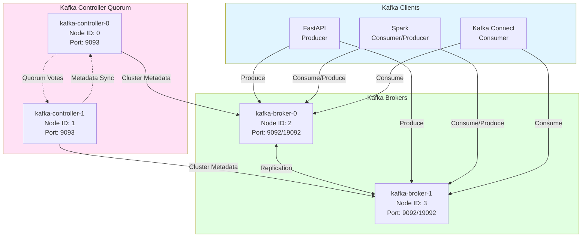
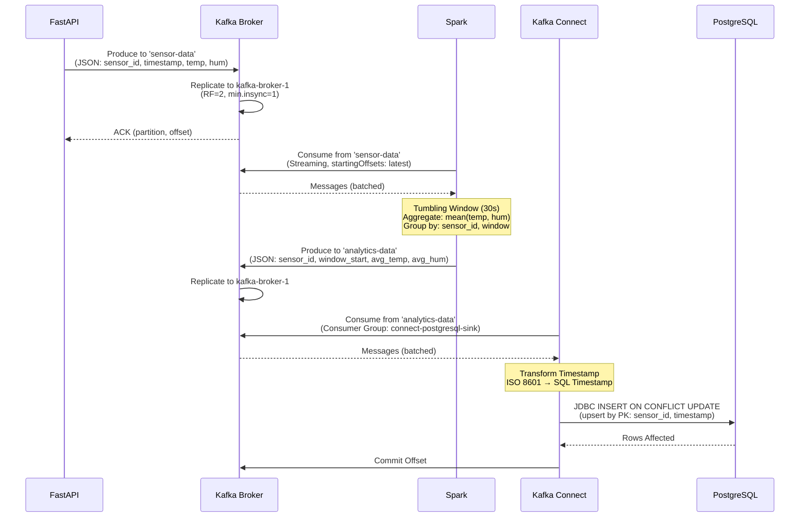

# 02 - Kafka Messaging

## Übersicht

Apache Kafka dient als **zentraler Event-Streaming-Bus** für alle Datenflüsse im System. Das Setup nutzt **Kafka 4.1.0 im KRaft-Modus** (ohne ZooKeeper) mit einer hochverfügbaren Architektur: 2 Controller für Cluster-Metadata, 2 Broker für Datenverarbeitung.

**Namespace:** `messaging`

## Kafka KRaft Mode Architektur

### Was ist KRaft?

**KRaft** (Kafka Raft) ersetzt ZooKeeper als Metadata-Store ab Kafka 2.8. Vorteile:

- ✅ **Vereinfachte Architektur** - Keine separate ZooKeeper-Installation
- ✅ **Bessere Performance** - Schnellere Metadata-Updates
- ✅ **Skalierbarkeit** - Bis zu Millionen Partitionen pro Cluster
- ✅ **Zukunftssicher** - ZooKeeper-Modus wird ab Kafka 4.0 deprecated

### Cluster-Topologie



**Rollen:**
- **Controller (Quorum):** Verwalten Cluster-Metadata (Topics, Partitions, Replicas)
- **Broker:** Verarbeiten Client-Requests (Produce, Consume)

### Node ID Berechnung

**Wichtig:** Alle Kafka-Knoten benötigen eindeutige Node IDs!

**Controller (Node ID 0, 1):**
```bash
# Extrahiert aus Hostname: kafka-controller-0 → 0
HOSTNAME=$(hostname)
export KAFKA_NODE_ID=${HOSTNAME##*-}
```

**Broker (Node ID 2, 3):**
```bash
# Offset +2 um Kollision mit Controllern zu vermeiden
NODE_ID=${HOSTNAME##*-}
export KAFKA_NODE_ID=$((NODE_ID + 2))
```

**Template:** [`helm-charts/system-cluster/templates/kafka.yaml`](../helm-charts/system-cluster/templates/kafka.yaml)

## Kafka Controller

### StatefulSet Konfiguration

**Replicas:** 2 (für Quorum-Mehrheit bei Ausfällen)

**Kritische Umgebungsvariablen:**
```yaml
env:
  CLUSTER_ID: "MkU3OEVBNTcwNTJENDM2Qk"
  KAFKA_PROCESS_ROLES: "controller"
  KAFKA_NODE_ID: "${HOSTNAME##*-}"
  KAFKA_CONTROLLER_QUORUM_VOTERS: |
    0@kafka-controller-0.kafka-controller.messaging.svc.cluster.local:9093,
    1@kafka-controller-1.kafka-controller.messaging.svc.cluster.local:9093
  KAFKA_LISTENERS: "CONTROLLER://:9093"
  KAFKA_CONTROLLER_LISTENER_NAMES: "CONTROLLER"
```

**CLUSTER_ID:**
- Base64-kodierte UUID (`MkU3OEVBNTcwNTJENDM2Qk` = "2E3EEA57052D436B")
- **MUSS identisch** für alle Controller + Broker sein
- Generierung: `kafka-storage.sh random-uuid | base64`

**Quorum Voters:**
- Statische Liste aller Controller (FQDN + Port)
- Format: `<node-id>@<fqdn>:<port>`
- Verwendet Headless Service für stabile DNS-Namen

### Headless Service

```yaml
apiVersion: v1
kind: Service
metadata:
  name: kafka-controller
  namespace: messaging
spec:
  clusterIP: None  # Headless Service
  selector:
    app: kafka-controller
  ports:
    - name: controller
      port: 9093
      targetPort: 9093
```

**Zweck:** DNS-Auflösung für StatefulSet-Pods

**DNS-Namen:**
- `kafka-controller-0.kafka-controller.messaging.svc.cluster.local`
- `kafka-controller-1.kafka-controller.messaging.svc.cluster.local`

## Kafka Broker

### StatefulSet Konfiguration

**Replicas:** 2 (für Datenredundanz, Replication Factor 2)

**Kritische Umgebungsvariablen:**
```yaml
env:
  CLUSTER_ID: "MkU3OEVBNTcwNTJENDM2Qk"
  KAFKA_PROCESS_ROLES: "broker"
  KAFKA_NODE_ID: "${HOSTNAME##*-} + 2"  # Offset!
  KAFKA_CONTROLLER_QUORUM_VOTERS: |
    0@kafka-controller-0.kafka-controller.messaging.svc.cluster.local:9093,
    1@kafka-controller-1.kafka-controller.messaging.svc.cluster.local:9093

  # Listener Configuration
  KAFKA_LISTENERS: "PLAINTEXT://:9092,PLAINTEXT_INTERNAL://:19092"
  KAFKA_ADVERTISED_LISTENERS: |
    PLAINTEXT://$(hostname -f):9092,
    PLAINTEXT_INTERNAL://$(hostname -f):19092
  KAFKA_LISTENER_SECURITY_PROTOCOL_MAP: |
    PLAINTEXT:PLAINTEXT,
    PLAINTEXT_INTERNAL:PLAINTEXT,
    CONTROLLER:PLAINTEXT
  KAFKA_INTER_BROKER_LISTENER_NAME: "PLAINTEXT_INTERNAL"

  # Topic Defaults
  KAFKA_OFFSETS_TOPIC_NUM_PARTITIONS: 50
  KAFKA_DEFAULT_REPLICATION_FACTOR: 2
  KAFKA_MIN_INSYNC_REPLICAS: 1
  KAFKA_NUM_PARTITIONS: 1

  # Performance
  KAFKA_LOG_DIRS: "/var/lib/kafka/data"
  KAFKA_LOG_RETENTION_HOURS: 168  # 7 Tage
```

### Listener-Konfiguration

**Kafka nutzt 2 Listener:**

1. **PLAINTEXT (Port 9092)** - Clients (FastAPI, Spark, Kafka Connect)
2. **PLAINTEXT_INTERNAL (Port 19092)** - Inter-Broker Communication (Replication)

**Advertised Listeners:**
```bash
# Dynamisch berechnet via hostname -f
PLAINTEXT://kafka-broker-0.kafka-broker.messaging.svc.cluster.local:9092
PLAINTEXT://kafka-broker-1.kafka-broker.messaging.svc.cluster.local:9092
```

**Warum FQDN statt Pod-IP?**
- DNS-basierte Service-Discovery (robuster)
- Funktioniert auch bei Pod-Neustarts (IP ändert sich, DNS bleibt)
- Headless Service garantiert stabile Namen

### Services

**Headless Service (für StatefulSet DNS):**
```yaml
apiVersion: v1
kind: Service
metadata:
  name: kafka-broker
  namespace: messaging
spec:
  clusterIP: None
  selector:
    app: kafka-broker
  ports:
    - name: plaintext
      port: 9092
    - name: internal
      port: 19092
```

**Client-facing Service (Load-Balancing):**
```yaml
apiVersion: v1
kind: Service
metadata:
  name: kafka
  namespace: messaging
spec:
  type: ClusterIP
  selector:
    app: kafka-broker
  ports:
    - name: plaintext
      port: 9092
      targetPort: 9092
```

**Connection String für Clients:**
```
kafka.messaging.svc.cluster.local:9092
```

→ Round-Robin Load-Balancing über beide Broker

### PersistentVolumes

**Pro Broker:** 5 GB Storage

```yaml
volumeClaimTemplates:
  - metadata:
      name: kafka-data
    spec:
      accessModes: ["ReadWriteOnce"]
      storageClassName: standard
      resources:
        requests:
          storage: 5Gi
```

**Mounted als:** `/var/lib/kafka/data`

**Zweck:**
- Topic Partition Logs
- Consumer Offsets (`__consumer_offsets` Topic)
- Transaction State (`__transaction_state` Topic)

## Topics

### Automatische Topic-Erstellung

Kafka ist konfiguriert für **automatische Topic-Erstellung** beim ersten Produce:

```yaml
KAFKA_AUTO_CREATE_TOPICS_ENABLE: "true"  # Default
KAFKA_NUM_PARTITIONS: 1                  # Default Partitions
KAFKA_DEFAULT_REPLICATION_FACTOR: 2      # Default RF
```

### Produktions-Topics

| Topic Name | Producer | Consumer | Partitions | Replication Factor | Retention |
|------------|----------|----------|------------|--------------------|-----------|
| `sensor-data` | FastAPI | Spark | 1 | 2 | 7 Tage |
| `analytics-data` | Spark | Kafka Connect | 1 | 2 | 7 Tage |

**Interne Topics:**
| Topic Name | Zweck | Partitions | Replication Factor |
|------------|-------|------------|--------------------|
| `__consumer_offsets` | Consumer Group Offsets | 50 | 2 |
| `__transaction_state` | Transactional State | 50 | 2 |

### Topic-Management

**Topics auflisten:**
```bash
kubectl exec -n messaging kafka-broker-0 -- \
  kafka-topics.sh --bootstrap-server localhost:9092 --list
```

**Topic Details:**
```bash
kubectl exec -n messaging kafka-broker-0 -- \
  kafka-topics.sh --bootstrap-server localhost:9092 \
  --describe --topic sensor-data
```

**Topic erstellen (manuell):**
```bash
kubectl exec -n messaging kafka-broker-0 -- \
  kafka-topics.sh --bootstrap-server localhost:9092 \
  --create --topic test-topic \
  --partitions 3 \
  --replication-factor 2
```

**Topic löschen:**
```bash
kubectl exec -n messaging kafka-broker-0 -- \
  kafka-topics.sh --bootstrap-server localhost:9092 \
  --delete --topic test-topic
```

## Kafka Connect

### JDBC Sink Connector

**Image:** Custom-built `localhost/postgres-kafka-connector:latest`

**Dockerfile:** [`postgresql-connector/Dockerfile.postgres-connector`](../postgresql-connector/Dockerfile.postgres-connector)

**Base Image:** `confluentinc/cp-kafka-connect:7.5.0`

**Installierte Plugins:**
```bash
# Confluent Hub JDBC Connector
confluent-hub install --no-prompt confluentinc/kafka-connect-jdbc:10.7.4

# PostgreSQL JDBC Driver
curl -o /usr/share/java/kafka/postgresql-42.6.0.jar \
  https://jdbc.postgresql.org/download/postgresql-42.6.0.jar
```

### Connector-Konfiguration

**Config:** [`postgresql-connector/connector-config.json`](../postgresql-connector/connector-config.json)

```json
{
  "name": "postgresql-sink",
  "config": {
    "connector.class": "io.confluent.connect.jdbc.JdbcSinkConnector",
    "tasks.max": "1",
    "topics": "analytics-data",
    "connection.url": "jdbc:postgresql://postgresql.data.svc.cluster.local:5432/sensordata",
    "connection.user": "appuser",
    "connection.password": "appuser-secure-pw",
    "auto.create": "false",
    "insert.mode": "upsert",
    "pk.mode": "record_key",
    "pk.fields": "sensor_id,timestamp",
    "table.name.format": "analytics_data",
    "transforms": "TimestampConverter",
    "transforms.TimestampConverter.type": "org.apache.kafka.connect.transforms.TimestampConverter$Value",
    "transforms.TimestampConverter.target.type": "Timestamp",
    "transforms.TimestampConverter.field": "timestamp",
    "transforms.TimestampConverter.format": "yyyy-MM-dd'T'HH:mm:ss"
  }
}
```

**Wichtige Parameter:**

- **`insert.mode: upsert`** - INSERT ON CONFLICT UPDATE (verhindert Duplikate)
- **`pk.fields`** - Composite Primary Key: `(sensor_id, timestamp)`
- **`transforms.TimestampConverter`** - ISO 8601 String → SQL Timestamp
- **`auto.create: false`** - Tabelle muss existieren (via PostgreSQL Init-Script)

### Startup-Prozess

**Entrypoint:** [`postgresql-connector/start.sh`](../postgresql-connector/start.sh)

```bash
#!/bin/bash
# 1. Warte auf Kafka Broker
until kafka-topics --bootstrap-server kafka.messaging.svc.cluster.local:9092 --list; do
  sleep 5
done

# 2. Warte auf PostgreSQL
until pg_isready -h postgresql.data.svc.cluster.local -p 5432 -U appuser; do
  sleep 5
done

# 3. Starte Kafka Connect (Hintergrund)
/etc/confluent/docker/run &
sleep 30

# 4. Registriere Connector
curl -X POST http://localhost:8083/connectors \
  -H "Content-Type: application/json" \
  -d @/connector-config.json

# 5. Halte Container am Leben
tail -f /var/log/kafka/connect.log
```

**Deployment:** [`helm-charts/system-cluster/templates/postgresql-connect.yaml`](../helm-charts/system-cluster/templates/postgresql-connect.yaml)

### Connector-Management

**Connector Status prüfen:**
```bash
kubectl exec -n messaging deployment/kafka-connect -- \
  curl -s http://localhost:8083/connectors/postgresql-sink/status | jq
```

**Connector neustarten:**
```bash
kubectl exec -n messaging deployment/kafka-connect -- \
  curl -X POST http://localhost:8083/connectors/postgresql-sink/restart
```

**Connector löschen:**
```bash
kubectl exec -n messaging deployment/kafka-connect -- \
  curl -X DELETE http://localhost:8083/connectors/postgresql-sink
```

**Logs anschauen:**
```bash
kubectl logs -n messaging deployment/kafka-connect -f
```

## Datenfluss (Messaging-Perspektive)



## Performance-Tuning

### Broker-Konfiguration

**Replica Fetcher Threads:**
```yaml
KAFKA_NUM_REPLICA_FETCHERS: 4  # Parallelität für Replication
```

**Log Segment Size:**
```yaml
KAFKA_LOG_SEGMENT_BYTES: 1073741824  # 1 GB
```

**Log Retention:**
```yaml
KAFKA_LOG_RETENTION_HOURS: 168      # 7 Tage
KAFKA_LOG_RETENTION_BYTES: -1       # Unbegrenzt (nur Zeit-basiert)
```

**Compression:**
```yaml
KAFKA_COMPRESSION_TYPE: "producer"  # Client entscheidet
```

### Producer-Optimierung (FastAPI)

```python
# confluent_kafka Producer Config
producer_config = {
    'bootstrap.servers': 'kafka.messaging.svc.cluster.local:9092',
    'acks': 1,  # Leader Acknowledgement (nicht alle Replicas)
    'linger.ms': 10,  # Batching: warte 10ms auf weitere Messages
    'batch.size': 16384,  # 16 KB Batch-Größe
    'compression.type': 'lz4'  # Schnelle Kompression
}
```

### Consumer-Optimierung (Spark)

```python
# Spark Kafka Consumer Config
spark.conf.set("spark.sql.streaming.kafka.consumer.cache.enabled", "true")
spark.conf.set("spark.streaming.kafka.maxRatePerPartition", "1000")
```

## Monitoring

### Kafka Metriken (JMX)

**Wichtige JMX Metriken (noch nicht exponiert):**

- `kafka.server:type=BrokerTopicMetrics,name=MessagesInPerSec`
- `kafka.server:type=BrokerTopicMetrics,name=BytesInPerSec`
- `kafka.network:type=RequestMetrics,name=RequestsPerSec`
- `kafka.controller:type=KafkaController,name=ActiveControllerCount`

**Für Prometheus-Integration:**
```yaml
# JMX Exporter als Sidecar (geplant)
- name: jmx-exporter
  image: sscaling/jmx-prometheus-exporter:latest
  ports:
    - containerPort: 5556
```

### Health Checks

**Broker Liveness:**
```bash
# Prüfe ob Kafka-Prozess läuft
ps aux | grep kafka
```

**Broker Readiness:**
```bash
# Prüfe Topic-Listing
kafka-topics.sh --bootstrap-server localhost:9092 --list
```

**Replication Status:**
```bash
# Unter-replizierte Partitions
kafka-topics.sh --bootstrap-server localhost:9092 \
  --describe --under-replicated-partitions
```

## Sicherheit

### Aktuelle Konfiguration (Development)

- ⚠️ **Kein TLS/SSL** - Plaintext-Kommunikation
- ⚠️ **Keine Authentifizierung** - Keine SASL
- ⚠️ **Keine Autorisierung** - Keine ACLs

### Produktions-Anforderungen

**TLS/SSL Encryption:**
```yaml
KAFKA_LISTENERS: "SSL://:9093"
KAFKA_SSL_KEYSTORE_FILENAME: "kafka.server.keystore.jks"
KAFKA_SSL_KEYSTORE_CREDENTIALS: "keystore_creds"
KAFKA_SSL_KEY_CREDENTIALS: "key_creds"
KAFKA_SSL_TRUSTSTORE_FILENAME: "kafka.server.truststore.jks"
KAFKA_SSL_TRUSTSTORE_CREDENTIALS: "truststore_creds"
```

**SASL Authentication (SCRAM-SHA-512):**
```yaml
KAFKA_SASL_ENABLED_MECHANISMS: "SCRAM-SHA-512"
KAFKA_SASL_MECHANISM_INTER_BROKER_PROTOCOL: "SCRAM-SHA-512"
```

**ACLs (Authorization):**
```bash
kafka-acls.sh --bootstrap-server localhost:9092 \
  --add --allow-principal User:fastapi \
  --operation Write --topic sensor-data
```

## Troubleshooting

### Häufige Kafka-Probleme

**Problem: Broker startet nicht (Quorum nicht erreichbar)**
```bash
# Controller Logs prüfen
kubectl logs -n messaging kafka-controller-0 | grep -i quorum

# Quorum Voters DNS testen
kubectl exec -n messaging kafka-broker-0 -- \
  nslookup kafka-controller-0.kafka-controller.messaging.svc.cluster.local
```

**Problem: Messages kommen nicht an**
```bash
# Topic existiert?
kubectl exec -n messaging kafka-broker-0 -- \
  kafka-topics.sh --bootstrap-server localhost:9092 --list

# Consumer Groups prüfen
kubectl exec -n messaging kafka-broker-0 -- \
  kafka-consumer-groups.sh --bootstrap-server localhost:9092 --list

# Consumer Lag
kubectl exec -n messaging kafka-broker-0 -- \
  kafka-consumer-groups.sh --bootstrap-server localhost:9092 \
  --describe --group connect-postgresql-sink
```

**Problem: Unter-replizierte Partitions**
```bash
# Identifiziere betroffene Topics
kubectl exec -n messaging kafka-broker-0 -- \
  kafka-topics.sh --bootstrap-server localhost:9092 \
  --describe --under-replicated-partitions

# Broker Logs (Replication Errors)
kubectl logs -n messaging kafka-broker-1 | grep -i replica
```

**Problem: Kafka Connect Connector failed**
```bash
# Connector Status
kubectl exec -n messaging deployment/kafka-connect -- \
  curl -s http://localhost:8083/connectors/postgresql-sink/status

# Connector Tasks
kubectl exec -n messaging deployment/kafka-connect -- \
  curl -s http://localhost:8083/connectors/postgresql-sink/tasks/0/status

# Neustart
kubectl exec -n messaging deployment/kafka-connect -- \
  curl -X POST http://localhost:8083/connectors/postgresql-sink/restart
```

### Debugging-Tools

**Kafka Console Producer (Test-Nachrichten senden):**
```bash
kubectl exec -it -n messaging kafka-broker-0 -- \
  kafka-console-producer.sh --bootstrap-server localhost:9092 \
  --topic sensor-data

# Eingabe (JSON):
{"sensor_id":"TEST-001","timestamp":"2025-12-14T10:30:00","temperature":22.5,"humidity":65.0}
```

**Kafka Console Consumer (Nachrichten lesen):**
```bash
kubectl exec -it -n messaging kafka-broker-0 -- \
  kafka-console-consumer.sh --bootstrap-server localhost:9092 \
  --topic sensor-data --from-beginning --max-messages 10
```

**Topic-Nachrichten zählen:**
```bash
kubectl exec -n messaging kafka-broker-0 -- \
  kafka-run-class.sh kafka.tools.GetOffsetShell \
  --broker-list localhost:9092 \
  --topic sensor-data --time -1
```

## Weiterführende Dokumentation

- **[03 - Data Processing](03-Data-Processing.md)** - Spark Konsumiert Kafka Topics
- **[08 - Troubleshooting](08-Troubleshooting.md)** - Debug-Dataflow-Skript
- **[Apache Kafka Documentation](https://kafka.apache.org/documentation/)** - Offizielle Docs
- **[KRaft Mode](https://kafka.apache.org/documentation/#kraft)** - KRaft Architecture
- **[Kafka Connect](https://docs.confluent.io/platform/current/connect/index.html)** - Confluent Docs

---

**Navigation:** [← Zurück zu Infrastruktur](01-Infrastruktur.md) | [Weiter zu Data Processing →](03-Data-Processing.md)
