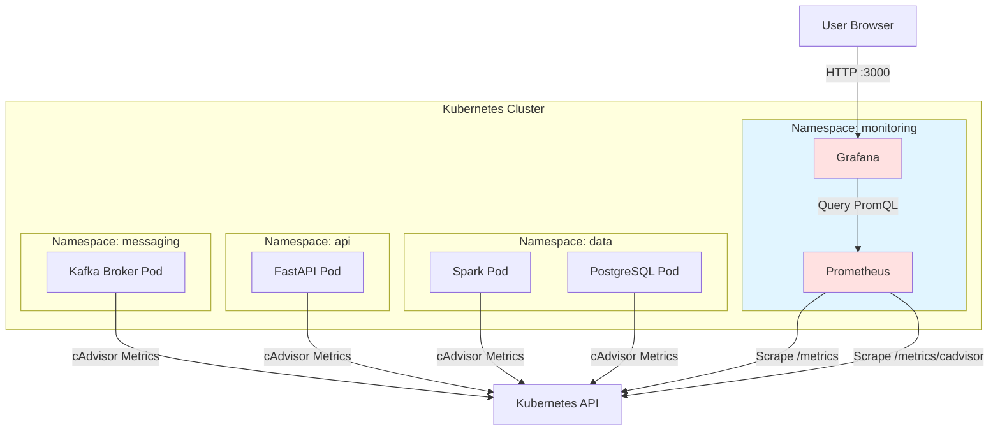

# 05 - Monitoring

## Übersicht

Das Monitoring-System basiert auf **Prometheus** (Metriken-Sammlung) und **Grafana** (Visualisierung & Dashboards). Es überwacht alle Cluster-Komponenten in Echtzeit und stellt 5 vorkonfigurierte Dashboards bereit.

**Namespace:** `monitoring`

## Prometheus

### Konfiguration

**Image:** `prom/prometheus:v3.7.1`

**Template:** [`helm-charts/system-cluster/templates/prometheus.yaml`](../helm-charts/system-cluster/templates/prometheus.yaml)

#### Prometheus Config (ConfigMap)

```yaml
global:
  scrape_interval: 15s
  evaluation_interval: 15s

scrape_configs:
  # Kubernetes API Server
  - job_name: 'kubernetes-apiservers'
    kubernetes_sd_configs:
      - role: endpoints
    scheme: https
    tls_config:
      ca_file: /var/run/secrets/kubernetes.io/serviceaccount/ca.crt
    bearer_token_file: /var/run/secrets/kubernetes.io/serviceaccount/token
    relabel_configs:
      - source_labels: [__meta_kubernetes_namespace, __meta_kubernetes_service_name, __meta_kubernetes_endpoint_port_name]
        action: keep
        regex: default;kubernetes;https

  # Kubelet Metrics
  - job_name: 'kubernetes-nodes'
    kubernetes_sd_configs:
      - role: node
    scheme: https
    tls_config:
      ca_file: /var/run/secrets/kubernetes.io/serviceaccount/ca.crt
    bearer_token_file: /var/run/secrets/kubernetes.io/serviceaccount/token
    relabel_configs:
      - action: labelmap
        regex: __meta_kubernetes_node_label_(.+)

  # cAdvisor (Container Metrics)
  - job_name: 'kubernetes-cadvisor'
    kubernetes_sd_configs:
      - role: node
    scheme: https
    tls_config:
      ca_file: /var/run/secrets/kubernetes.io/serviceaccount/ca.crt
    bearer_token_file: /var/run/secrets/kubernetes.io/serviceaccount/token
    metrics_path: /metrics/cadvisor
    relabel_configs:
      - action: labelmap
        regex: __meta_kubernetes_node_label_(.+)
```

**Wichtige Parameter:**
- **Scrape Interval:** 15 Sekunden (Balance zwischen Granularität und Storage)
- **Retention:** 15 Tage (via `--storage.tsdb.retention.time=15d`)
- **Storage:** 10 GB PersistentVolume

### Deployment

```yaml
apiVersion: apps/v1
kind: Deployment
metadata:
  name: prometheus
  namespace: {{ .Values.prometheus.namespace }}
spec:
  replicas: 1
  selector:
    matchLabels:
      app: prometheus
  template:
    metadata:
      labels:
        app: prometheus
    spec:
      serviceAccountName: prometheus
      containers:
      - name: prometheus
        image: {{ .Values.prometheus.image }}
        args:
          - '--config.file=/etc/prometheus/prometheus.yml'
          - '--storage.tsdb.path=/prometheus'
          - '--storage.tsdb.retention.time=15d'
          - '--web.console.libraries=/usr/share/prometheus/console_libraries'
          - '--web.console.templates=/usr/share/prometheus/consoles'
        ports:
        - containerPort: 9090
          name: web
        volumeMounts:
        - name: config
          mountPath: /etc/prometheus
        - name: storage
          mountPath: /prometheus
        resources:
          {{- toYaml .Values.prometheus.resources | nindent 10 }}
      volumes:
      - name: config
        configMap:
          name: prometheus-config
      - name: storage
        persistentVolumeClaim:
          claimName: prometheus-storage
```

### ServiceAccount & RBAC

**Prometheus benötigt Berechtigungen für Kubernetes API:**

```yaml
apiVersion: v1
kind: ServiceAccount
metadata:
  name: prometheus
  namespace: monitoring
---
apiVersion: rbac.authorization.k8s.io/v1
kind: ClusterRole
metadata:
  name: prometheus
rules:
- apiGroups: [""]
  resources:
    - nodes
    - nodes/proxy
    - services
    - endpoints
    - pods
  verbs: ["get", "list", "watch"]
- apiGroups:
    - extensions
  resources:
    - ingresses
  verbs: ["get", "list", "watch"]
---
apiVersion: rbac.authorization.k8s.io/v1
kind: ClusterRoleBinding
metadata:
  name: prometheus
roleRef:
  apiGroup: rbac.authorization.k8s.io
  kind: ClusterRole
  name: prometheus
subjects:
- kind: ServiceAccount
  name: prometheus
  namespace: monitoring
```

### Service

```yaml
apiVersion: v1
kind: Service
metadata:
  name: prometheus
  namespace: monitoring
spec:
  type: ClusterIP
  selector:
    app: prometheus
  ports:
    - port: 9090
      targetPort: 9090
      name: web
```

**Zugriff:**
```bash
# Via Port-Forwarding
kubectl port-forward -n monitoring svc/prometheus 9090:9090

# URL: http://localhost:9090
```

### Wichtige Metriken

#### Container-Metriken (cAdvisor)

```promql
# CPU Usage (Cores)
container_cpu_usage_seconds_total{namespace="messaging"}

# Memory Usage (Bytes)
container_memory_usage_bytes{namespace="messaging"}

# Network Rx (Bytes)
container_network_receive_bytes_total{namespace="messaging"}

# Network Tx (Bytes)
container_network_transmit_bytes_total{namespace="messaging"}
```

#### Node-Metriken (Kubelet)

```promql
# Node CPU Usage
node_cpu_seconds_total{mode="idle"}

# Node Memory
node_memory_MemAvailable_bytes

# Node Disk Usage
node_filesystem_avail_bytes{mountpoint="/"}
```

#### Kubernetes-Metriken

```promql
# Pod Status
kube_pod_status_phase{namespace="messaging"}

# Container Restarts
kube_pod_container_status_restarts_total

# Deployment Replicas
kube_deployment_status_replicas_available{namespace="api"}
```

## Grafana

### Konfiguration

**Image:** `grafana/grafana:11.4.0`

**Template:** [`helm-charts/system-cluster/templates/grafana.yaml`](../helm-charts/system-cluster/templates/grafana.yaml)

#### Datasource Provisioning

**ConfigMap (grafana-datasource.yaml):**
```yaml
apiVersion: 1
datasources:
  - name: Prometheus
    type: prometheus
    access: proxy
    url: http://prometheus.monitoring.svc.cluster.local:9090
    isDefault: true
    editable: true
```

**Mounted als:** `/etc/grafana/provisioning/datasources/`

→ Prometheus wird automatisch bei Grafana-Start registriert

#### Dashboard Provisioning

**ConfigMap (grafana-dashboards.yaml):**
```yaml
apiVersion: 1
providers:
  - name: 'Default'
    orgId: 1
    folder: ''
    type: file
    disableDeletion: false
    updateIntervalSeconds: 10
    allowUiUpdates: true
    options:
      path: /var/lib/grafana/dashboards
```

**Dashboard JSONs:** [`helm-charts/system-cluster/grafana/`](../helm-charts/system-cluster/grafana/)

- `cluster-resources-dashboard.json`
- `api-namespace-dashboard.json`
- `messaging-namespace-dashboard.json`
- `data-namespace-dashboard.json`
- `monitoring-namespace-dashboard.json`

**Mounted als:** `/var/lib/grafana/dashboards/`

### Deployment

```yaml
apiVersion: apps/v1
kind: Deployment
metadata:
  name: grafana
  namespace: {{ .Values.grafana.namespace }}
spec:
  replicas: 1
  selector:
    matchLabels:
      app: grafana
  template:
    metadata:
      labels:
        app: grafana
    spec:
      containers:
      - name: grafana
        image: {{ .Values.grafana.image }}
        ports:
        - containerPort: 3000
          name: web
        env:
        - name: GF_SECURITY_ADMIN_USER
          value: {{ .Values.grafana.adminUser }}
        - name: GF_SECURITY_ADMIN_PASSWORD
          value: {{ .Values.grafana.adminPassword }}
        - name: GF_PATHS_PROVISIONING
          value: /etc/grafana/provisioning
        volumeMounts:
        - name: storage
          mountPath: /var/lib/grafana
        - name: datasource
          mountPath: /etc/grafana/provisioning/datasources
        - name: dashboards-config
          mountPath: /etc/grafana/provisioning/dashboards
        - name: dashboards
          mountPath: /var/lib/grafana/dashboards
        resources:
          {{- toYaml .Values.grafana.resources | nindent 10 }}
      volumes:
      - name: storage
        persistentVolumeClaim:
          claimName: grafana-storage
      - name: datasource
        configMap:
          name: grafana-datasource
      - name: dashboards-config
        configMap:
          name: grafana-dashboards-config
      - name: dashboards
        configMap:
          name: grafana-dashboards
```

**Admin Credentials (values.yaml):**
```yaml
grafana:
  adminUser: admin
  adminPassword: admin
```

### Service

```yaml
apiVersion: v1
kind: Service
metadata:
  name: grafana
  namespace: monitoring
spec:
  type: ClusterIP
  selector:
    app: grafana
  ports:
    - port: 3000
      targetPort: 3000
      name: web
```

**Zugriff:**
```bash
# Via Port-Forwarding
kubectl port-forward -n monitoring svc/grafana 3000:3000

# URL: http://localhost:3000
# Login: admin / admin
```

## Dashboards

### 1. Cluster Resources Dashboard

**Datei:** [`grafana/cluster-resources-dashboard.json`](../helm-charts/system-cluster/grafana/cluster-resources-dashboard.json)

**Panels:**

#### CPU Usage
```promql
# Gesamt CPU (alle Namespaces)
sum(rate(container_cpu_usage_seconds_total[5m])) by (namespace)

# Top 10 Pods nach CPU
topk(10,
  sum(rate(container_cpu_usage_seconds_total[5m])) by (pod, namespace)
)
```

#### Memory Usage
```promql
# Gesamt Memory
sum(container_memory_usage_bytes) by (namespace)

# Memory mit Limits
sum(container_memory_usage_bytes) by (pod, namespace) /
sum(container_spec_memory_limit_bytes) by (pod, namespace) * 100
```

#### Network Traffic
```promql
# Network Rx Rate
sum(rate(container_network_receive_bytes_total[5m])) by (namespace)

# Network Tx Rate
sum(rate(container_network_transmit_bytes_total[5m])) by (namespace)
```

#### Storage Usage
```promql
# PVC Usage
sum(kubelet_volume_stats_used_bytes) by (persistentvolumeclaim, namespace) /
sum(kubelet_volume_stats_capacity_bytes) by (persistentvolumeclaim, namespace) * 100
```

### 2. API Namespace Dashboard

**Panels:**

- FastAPI Pod Status (Running/Failed)
- HTTP Request Rate (requests/s)
- HTTP Response Times (p50, p95, p99)
- Error Rate (4xx, 5xx)
- NGINX Ingress Metrics (Connections, Requests)

**Wichtige Queries:**
```promql
# FastAPI Pods
kube_pod_status_phase{namespace="api", pod=~"fastapi-.*"}

# HTTP Request Rate (via NGINX)
sum(rate(nginx_ingress_controller_requests[5m])) by (status)
```

### 3. Messaging Namespace Dashboard

**Panels:**

- Kafka Broker Status
- Kafka Controller Status
- Kafka Connect Status
- CPU/Memory per Pod
- Network Traffic (Kafka Replication)

**Queries:**
```promql
# Kafka Broker CPU
sum(rate(container_cpu_usage_seconds_total{namespace="messaging", pod=~"kafka-broker-.*"}[5m])) by (pod)

# Kafka Network Tx (Replication)
sum(rate(container_network_transmit_bytes_total{namespace="messaging", pod=~"kafka-broker-.*"}[5m]))
```

### 4. Data Namespace Dashboard

**Panels:**

- Spark Pod Status
- PostgreSQL Pod Status
- Spark CPU/Memory
- PostgreSQL CPU/Memory/Disk
- PostgreSQL Connections

**Queries:**
```promql
# PostgreSQL Disk Usage
kubelet_volume_stats_used_bytes{namespace="data", persistentvolumeclaim="postgresql-data-postgresql-0"}

# PostgreSQL Pod Restarts
kube_pod_container_status_restarts_total{namespace="data", pod="postgresql-0"}
```

### 5. Monitoring Namespace Dashboard

**Panels:**

- Prometheus Status
- Grafana Status
- Prometheus Scrape Duration
- Prometheus Storage Size
- Grafana Dashboard Load Times

**Queries:**
```promql
# Prometheus Scrape Duration
prometheus_target_interval_length_seconds{quantile="0.99"}

# Prometheus TSDB Size
prometheus_tsdb_storage_blocks_bytes
```

## Monitoring-Stack Architektur



## Alerting (geplant)

### Prometheus Alertmanager

**Beispiel-Alert-Regeln:**

```yaml
groups:
  - name: kubernetes
    interval: 30s
    rules:
      # Pod Down
      - alert: PodDown
        expr: kube_pod_status_phase{phase="Failed"} > 0
        for: 5m
        labels:
          severity: critical
        annotations:
          summary: "Pod {{ $labels.pod }} in {{ $labels.namespace }} failed"

      # High CPU
      - alert: HighCPU
        expr: |
          sum(rate(container_cpu_usage_seconds_total[5m])) by (pod, namespace) > 0.8
        for: 10m
        labels:
          severity: warning
        annotations:
          summary: "Pod {{ $labels.pod }} high CPU usage"

      # High Memory
      - alert: HighMemory
        expr: |
          sum(container_memory_usage_bytes) by (pod, namespace) /
          sum(container_spec_memory_limit_bytes) by (pod, namespace) > 0.9
        for: 5m
        labels:
          severity: warning
        annotations:
          summary: "Pod {{ $labels.pod }} high memory usage"

      # Disk Full
      - alert: DiskFull
        expr: |
          kubelet_volume_stats_used_bytes /
          kubelet_volume_stats_capacity_bytes > 0.9
        for: 10m
        labels:
          severity: critical
        annotations:
          summary: "PVC {{ $labels.persistentvolumeclaim }} nearly full"
```

**Alertmanager Config (geplant):**
```yaml
route:
  receiver: 'slack'
  group_by: ['alertname', 'cluster']
  group_wait: 10s
  group_interval: 5m
  repeat_interval: 3h

receivers:
  - name: 'slack'
    slack_configs:
      - api_url: 'https://hooks.slack.com/services/...'
        channel: '#alerts'
        title: '{{ .GroupLabels.alertname }}'
        text: '{{ range .Alerts }}{{ .Annotations.summary }}{{ end }}'
```

## Performance-Metriken

### Durchsatz-Metriken

**Messages/Second (Kafka):**
```promql
# Producer Rate (FastAPI)
rate(container_network_transmit_bytes_total{namespace="api"}[5m])

# Consumer Rate (Spark)
rate(container_network_receive_bytes_total{namespace="data", pod="spark"}[5m])
```

**Database Writes/Second:**
```promql
# PostgreSQL Write Rate (via Kafka Connect Network)
rate(container_network_transmit_bytes_total{namespace="messaging", pod=~"kafka-connect-.*"}[5m])
```

### Latenz-Metriken

**HTTP Response Time (FastAPI):**
```promql
# Via NGINX Ingress
histogram_quantile(0.95,
  sum(rate(nginx_ingress_controller_request_duration_seconds_bucket[5m])) by (le)
)
```

**Spark Processing Time:**
```promql
# Manuell geloggt in Spark (geplant)
spark_streaming_batch_processing_time_ms
```

## Troubleshooting

### Prometheus-Probleme

**Problem: Keine Metriken sichtbar**
```bash
# Prometheus Targets prüfen
http://localhost:9090/targets

# ServiceAccount Permissions
kubectl describe clusterrolebinding prometheus

# Logs
kubectl logs -n monitoring deployment/prometheus -f
```

**Problem: Hoher Storage-Verbrauch**
```bash
# TSDB Size
kubectl exec -n monitoring deployment/prometheus -- \
  du -sh /prometheus

# Retention reduzieren (values.yaml)
prometheus:
  retention: "7d"  # Statt 15d
```

### Grafana-Probleme

**Problem: Dashboards nicht geladen**
```bash
# ConfigMap prüfen
kubectl get configmap -n monitoring grafana-dashboards -o yaml

# Provisioning Logs
kubectl logs -n monitoring deployment/grafana | grep -i provision
```

**Problem: Datasource Connection Failed**
```bash
# Prometheus Service DNS
kubectl exec -n monitoring deployment/grafana -- \
  nslookup prometheus.monitoring.svc.cluster.local

# Datasource Config
kubectl get configmap -n monitoring grafana-datasource -o yaml
```

**Problem: Login funktioniert nicht**
```bash
# Admin Passwort reset
kubectl exec -n monitoring deployment/grafana -- \
  grafana-cli admin reset-admin-password newpassword
```

## Weiterführende Dokumentation

- **[01 - Infrastruktur](01-Infrastruktur.md)** - Kubernetes Metriken
- **[Prometheus Documentation](https://prometheus.io/docs/)**
- **[Grafana Documentation](https://grafana.com/docs/)**
- **[PromQL Cheat Sheet](https://promlabs.com/promql-cheat-sheet/)**

---

**Navigation:** [← Zurück zu API Layer](04-API-Layer.md) | [Weiter zu Deployment →](06-Deployment.md)
