# 06 - Deployment

## Übersicht

Das Deployment-System automatisiert die vollständige Installation und Updates des Data Engineering Systems. Das Haupt-Skript `init.ps1` orchestriert alle Schritte von der Infrastruktur-Erstellung bis zum Test-Ausführung.

## Haupt-Deployment (init.ps1)

**Skript:** [`init.ps1`](../init.ps1)

**Gesamtdauer:** 15-20 Minuten (abhängig von Hardware)

### Deployment-Phasen

```mermaid
flowchart TD
    Start([init.ps1 Start]) --> P0[Phase 0: Prerequisites]
    P0 --> CheckKind{Kind installiert?}
    CheckKind -->|Nein| InstallKind[winget install kind]
    CheckKind -->|Ja| CheckKubectl{kubectl installiert?}
    InstallKind --> CheckKubectl
    CheckKubectl -->|Nein| InstallKubectl[winget install kubectl]
    CheckKubectl -->|Ja| CheckHelm{Helm installiert?}
    InstallKubectl --> CheckHelm
    CheckHelm -->|Nein| InstallHelm[winget install Helm]
    CheckHelm -->|Ja| P1[Phase 1: Podman & Cluster]

    P1 --> CheckPodman{Podman VM läuft?}
    CheckPodman -->|Nein| StartPodman[podman machine start]
    CheckPodman -->|Ja| CheckCluster{Cluster existiert?}
    StartPodman --> CheckCluster
    CheckCluster -->|Nein| CreateCluster[kind create cluster]
    CheckCluster -->|Ja| P2[Phase 2: Cluster Check]
    CreateCluster --> P2

    P2 --> VerifyAPI[kubectl cluster-info]
    VerifyAPI --> P3[Phase 3: Chart Lint]

    P3 --> HelmDep[helm dependency update]
    HelmDep --> HelmLint[helm lint]
    HelmLint --> P3A[Phase 3A: FastAPI Build]

    P3A --> BuildFastAPI[podman build + kind load]
    BuildFastAPI --> P3B[Phase 3B: Postgres Connector Build]

    P3B --> BuildConnector[podman build + kind load]
    BuildConnector --> P3C[Phase 3C: Spark Build]

    P3C --> BuildSpark[podman build + kind load]
    BuildSpark --> P4[Phase 4: Installation]

    P4 --> CheckRelease{Release existiert?}
    CheckRelease -->|Ja| HelmUpgrade[helm upgrade]
    CheckRelease -->|Nein| HelmInstall[helm install]
    HelmUpgrade --> P5[Phase 5: Status]
    HelmInstall --> P5

    P5 --> GetPods[kubectl get pods -A]
    GetPods --> P6[Phase 6: Tests]

    P6 --> Test1[pytest test_1_health.py]
    Test1 --> Test2[pytest test_2_connectivity.py]
    Test2 --> Test3[pytest test_3_functional.py]
    Test3 --> P7[Phase 7: Services starten]

    P7 --> PortForward[Start port-forward.ps1]
    PortForward --> Simulator[Start sensor_simulator.py]
    Simulator --> End([Deployment Complete])

    style Start fill:#e1f5ff
    style End fill:#e1ffe1
    style P0 fill:#ffe1e1
    style P1 fill:#ffe1e1
    style P2 fill:#ffe1e1
    style P3 fill:#fff4e1
    style P3A fill:#fff4e1
    style P3B fill:#fff4e1
    style P3C fill:#fff4e1
    style P4 fill:#e1ffe1
    style P5 fill:#e1ffe1
    style P6 fill:#e1f5ff
    style P7 fill:#e1f5ff
```



### Phase 0: Prerequisites

**Prüft und installiert:**
- Kind (Kubernetes in Docker)
- kubectl (Kubernetes CLI)
- Helm (Package Manager)
- Podman (Container Runtime)

```powershell
# Kind Installation
if (-not (Get-Command kind -ErrorAction SilentlyContinue)) {
    winget install Kubernetes.kind
}

# kubectl Installation
if (-not (Get-Command kubectl -ErrorAction SilentlyContinue)) {
    winget install Kubernetes.kubectl
}

# Helm Installation
if (-not (Get-Command helm -ErrorAction SilentlyContinue)) {
    winget install Helm.Helm
}
```

**Fehlerbehandlung:**
- Liste fehlender Tools in `$missingTools`
- Exit mit Installationsanweisungen wenn Tools fehlen

### Phase 1: Cluster erstellen/prüfen

**Podman VM Start:**
```powershell
$podmanMachines = podman machine list --format json | ConvertFrom-Json
$podmanState = $podmanMachines | Where-Object { $_.Name -eq "podman-machine-default" }

if ($podmanState.Running -ne $true) {
    Write-Log "INFO" "Starte Podman VM..."
    podman machine start
    Start-Sleep -Seconds 10
}
```

**Cluster Erstellung:**
```powershell
$env:KIND_EXPERIMENTAL_PROVIDER = "podman"
$clusterExists = kind get clusters 2>$null | Select-String -Pattern "^$clusterName$"

if (-not $clusterExists) {
    Write-Log "INFO" "Erstelle Kind Cluster..."
    kind create cluster --config kind-config.yaml --name $clusterName
    Start-Sleep -Seconds 120  # Warte auf Cluster-Bereitschaft
}
```

### Phase 2: Cluster Check

**API-Server Verfügbarkeit:**
```powershell
kubectl cluster-info --context kind-$clusterName | Out-Null
if ($LASTEXITCODE -ne 0) {
    throw "Cluster nicht erreichbar!"
}

# Warte auf API-Server
$maxRetries = 15
$retryCount = 0
$apiReady = $false

while ($retryCount -lt $maxRetries -and -not $apiReady) {
    try {
        kubectl get nodes | Out-Null
        $apiReady = $true
    } catch {
        Start-Sleep -Seconds 5
        $retryCount++
    }
}
```

### Phase 3: Chart Lint & Dependencies

**Helm Dependencies:**
```powershell
Set-Location $chartPath
helm dependency update
if ($LASTEXITCODE -ne 0) {
    throw "Helm dependency update fehlgeschlagen"
}
```

**Chart Validierung:**
```powershell
helm lint .
if ($LASTEXITCODE -ne 0) {
    throw "Helm Chart Validierung fehlgeschlagen"
}
```

### Phase 3A-C: Image Builds

**Jedes Image wird separat gebaut:**

```powershell
# Phase 3A: FastAPI
$deployScript = Join-Path $initScriptRoot "fastapi\deploy-fastapi.ps1"
if (Test-Path $deployScript) {
    & $deployScript -noHelm
    if ($LASTEXITCODE -ne 0) {
        throw "FastAPI Build fehlgeschlagen"
    }
}

# Phase 3B: Postgres Connector
$deployScript = Join-Path $initScriptRoot "postgresql-connector\deploy-postgres-connector.ps1"
if (Test-Path $deployScript) {
    & $deployScript -noHelm
}

# Phase 3C: Spark
$deployScript = Join-Path $initScriptRoot "spark\deploy-spark.ps1"
if (Test-Path $deployScript) {
    & $deployScript -noHelm
}
```

### Phase 4: Installation

**Release-Erkennung:**
```powershell
$releases = helm list -n default -o json 2>$null | ConvertFrom-Json
$releaseExists = $releases | Where-Object { $_.name -eq $clusterName }

if ($releaseExists) {
    Write-Log "INFO" "Führe Helm Upgrade aus..."
    helm upgrade $clusterName . -n default --wait --timeout=300s
} else {
    Write-Log "INFO" "Führe Helm Install aus..."
    helm install $clusterName . -n default --create-namespace --wait --timeout=300s
}
```

**Pending-Install Cleanup:**
```powershell
$releasePending = $releases | Where-Object {
    $_.name -eq $clusterName -and $_.status -eq "pending-install"
}

if ($releasePending) {
    Write-Log "WARN" "Pending Release gefunden, bereinige..."
    helm rollback $clusterName 0 -n default
    # oder: helm uninstall $clusterName -n default
}
```

### Phase 5: Status

**Pod-Status anzeigen:**
```powershell
kubectl get pods -n messaging
kubectl get svc -n messaging
kubectl get pods -A -n default
```

### Phase 6: Tests

**Automatische Test-Ausführung:**
```powershell
Start-Sleep -Seconds 10  # Warte bis Pods ready

Set-Location "$initScriptRoot/tests"
pytest test_1_health.py -v --tb=short
pytest test_2_connectivity.py -v --tb=short
pytest test_3_functional.py -v --tb=short
```

**Fehlerbehandlung:**
- Tests laufen weiter auch bei Failures (kein `exit 1`)
- Detaillierte Fehlerausgabe via `--tb=short`

### Phase 7: Services starten

**Port-Forwarding (Hintergrund):**
```powershell
$portForwardScript = Join-Path $initScriptRoot "port-forward.ps1"
Start-Process powershell -ArgumentList "-File", $portForwardScript -WindowStyle Minimized
```

**Sensor Simulator (Vordergrund):**
```powershell
$simulatorScript = Join-Path $initScriptRoot "simulator\sensor_simulator.py"
Start-Process powershell -ArgumentList `
    "-Command", `
    "cd '$initScriptRoot\simulator'; python sensor_simulator.py --interval 1.0 --sensors 15" `
    -WindowStyle Normal
```

## Build-Skripte

### FastAPI Build

**Skript:** [`fastapi/deploy-fastapi.ps1`](../fastapi/deploy-fastapi.ps1)

```powershell
param (
    [switch]$noHelm  # Nur Image bauen, kein Helm Upgrade
)

$clusterName = "system-cluster"
$imageName = "localhost/fastapi:latest"

# 1. Build mit Podman
Write-Host "Baue FastAPI Image..." -ForegroundColor Yellow
podman build -f Dockerfile.fastapi -t $imageName .
if ($LASTEXITCODE -ne 0) { exit 1 }

# 2. Export als tar
Write-Host "Exportiere Image..." -ForegroundColor Yellow
podman save $imageName -o fastapi.tar
if ($LASTEXITCODE -ne 0) { exit 1 }

# 3. Load in Kind
Write-Host "Lade Image in Kind Cluster..." -ForegroundColor Yellow
kind load image-archive fastapi.tar --name $clusterName
if ($LASTEXITCODE -ne 0) { exit 1 }

# 4. Cleanup
Remove-Item fastapi.tar -Force

# 5. Optional: Helm Upgrade
if (-not $noHelm) {
    Write-Host "Führe Helm Upgrade aus..." -ForegroundColor Yellow
    Set-Location ..\helm-charts\system-cluster
    helm upgrade system-cluster . -n default --wait --timeout=300s
}

Write-Host "FastAPI Image erfolgreich deployed" -ForegroundColor Green
```

**Verwendung:**
```powershell
# Nur Build (während init.ps1)
.\deploy-fastapi.ps1 -noHelm

# Build + Helm Upgrade (standalone)
.\deploy-fastapi.ps1
```

### Postgres Connector Build

**Skript:** [`postgresql-connector/deploy-postgres-connector.ps1`](../postgresql-connector/deploy-postgres-connector.ps1)

Identische Struktur wie FastAPI Build:
```powershell
$imageName = "localhost/postgres-kafka-connector:latest"
podman build -f Dockerfile.postgres-connector -t $imageName .
podman save $imageName -o postgres-connector.tar
kind load image-archive postgres-connector.tar --name $clusterName
Remove-Item postgres-connector.tar
```

### Spark Build

**Skript:** [`spark/deploy-spark.ps1`](../spark/deploy-spark.ps1)

Identische Struktur:
```powershell
$imageName = "localhost/spark:latest"
podman build -f Dockerfile.spark -t $imageName .
podman save $imageName -o spark.tar
kind load image-archive spark.tar --name $clusterName
Remove-Item spark.tar
```

## Update-Prozess (update.ps1)

**Skript:** [`update.ps1`](../update.ps1)

**Zweck:** Selektive Updates einzelner Komponenten ohne vollständigen Neuaufbau

### Interaktive Auswahl

```powershell
Write-Host "Welche Images möchten Sie aktualisieren?" -ForegroundColor Cyan
Write-Host "1. FastAPI"
Write-Host "2. Postgres Connector"
Write-Host "3. Spark"
Write-Host "4. Alle"
Write-Host "5. Abbrechen"

$choice = Read-Host "Auswahl (1-5)"

switch ($choice) {
    "1" { & "fastapi\deploy-fastapi.ps1" }
    "2" { & "postgresql-connector\deploy-postgres-connector.ps1" }
    "3" { & "spark\deploy-spark.ps1" }
    "4" {
        & "fastapi\deploy-fastapi.ps1" -noHelm
        & "postgresql-connector\deploy-postgres-connector.ps1" -noHelm
        & "spark\deploy-spark.ps1" -noHelm
        # Helm Upgrade am Ende
        helm upgrade system-cluster helm-charts/system-cluster -n default --wait
    }
    "5" { exit 0 }
}
```

### Intelligente Cluster-Erkennung

```powershell
# 1. Podman Machine Status
$podmanMachines = podman machine list --format json | ConvertFrom-Json
if (-not $podmanMachines -or $podmanMachines.Count -eq 0) {
    throw "Keine Podman Machine gefunden"
}

$podmanState = $podmanMachines | Where-Object { $_.Name -eq "podman-machine-default" }
if ($podmanState.Running -ne $true) {
    Write-Host "Starte Podman Machine..." -ForegroundColor Yellow
    podman machine start
    Start-Sleep -Seconds 10
}

# 2. Kind Cluster Status
$clusterExists = kind get clusters | Select-String -Pattern "^$clusterName$"
if (-not $clusterExists) {
    throw "Cluster '$clusterName' nicht gefunden. Führe init.ps1 aus."
}

# 3. Container Status (falls gestoppt)
$containerName = "$clusterName-control-plane"
$containerState = podman inspect $containerName --format '{{.State.Status}}' 2>$null

if ($containerState -eq "exited") {
    Write-Host "Starte Cluster Container..." -ForegroundColor Yellow
    podman start $containerName
    Start-Sleep -Seconds 30
}

# 4. Kubernetes API Erreichbarkeit
$maxRetries = 12
$retryCount = 0

while ($retryCount -lt $maxRetries) {
    try {
        kubectl cluster-info --context kind-$clusterName | Out-Null
        if ($LASTEXITCODE -eq 0) { break }
    } catch {
        Start-Sleep -Seconds 5
        $retryCount++
    }
}
```

## Port-Forwarding (port-forward.ps1)

**Skript:** [`port-forward.ps1`](../port-forward.ps1)

**Zweck:** Exponiert Services auf localhost für externe Zugriffe

```powershell
Write-Host "Starte Port-Forwarding..." -ForegroundColor Yellow

# Grafana (3000)
$grafanaJob = Start-Job -ScriptBlock {
    kubectl port-forward -n monitoring svc/grafana 3000:3000
}

# FastAPI (8000)
$fastapiJob = Start-Job -ScriptBlock {
    kubectl port-forward -n api svc/fastapi 8000:8000
}

Write-Host "Port-Forwarding aktiv:" -ForegroundColor Green
Write-Host "  Grafana:  http://localhost:3000" -ForegroundColor Cyan
Write-Host "  FastAPI:  http://localhost:8000" -ForegroundColor Cyan
Write-Host ""
Write-Host "Drücke Enter zum Beenden..." -ForegroundColor Yellow

Read-Host

# Cleanup
Stop-Job $grafanaJob
Stop-Job $fastapiJob
Remove-Job $grafanaJob
Remove-Job $fastapiJob

Write-Host "Port-Forwarding beendet" -ForegroundColor Green
```

**Automatischer Start:** via `init.ps1` in minimiertem Fenster

## Logging-System

### Write-Log Funktion

```powershell
$global:init_starttime = Get-Date

function Write-Log {
    param (
        [string]$LEVEL = "INFO",
        [string]$Message
    )

    # Farb-Mapping
    $color = switch ($LEVEL) {
        "INFO"    { "Yellow" }
        "DEBUG"   { "Cyan" }
        "SUCCESS" { "Green" }
        "WARN"    { "Orange" }
        "ERROR"   { "Red" }
        default   { "White" }
    }

    # Timestamp mit Offset
    $delay = $((Get-Date) - $init_starttime).TotalSeconds.ToString("F2")

    Write-Host "[init $delay s] $Message" -ForegroundColor $color
}
```

**Verwendung:**
```powershell
Write-Log "INFO" "[0/5] Prüfe Prerequisites..."
Write-Log "SUCCESS" "Cluster erstellt"
Write-Log "ERROR" "Helm Chart Validierung fehlgeschlagen"
```

**Warum keine Unicode-Symbole?**
- Kompatibilität mit allen Windows PowerShell Versionen
- Encoding-Probleme in älteren Terminals vermeiden
- Nur Farb-Codierung (konsistent und sicher)

## Deployment-Best-Practices

### 1. Idempotenz

Alle Skripte sind **idempotent** - mehrfaches Ausführen hat gleiches Ergebnis:

```powershell
# Cluster nur erstellen wenn nicht vorhanden
if (-not $clusterExists) {
    kind create cluster ...
}

# Helm: upgrade statt install wenn Release existiert
if ($releaseExists) {
    helm upgrade ...
} else {
    helm install ...
}
```

### 2. Fehlerbehandlung

**Try-Finally für Cleanup:**
```powershell
$initScriptRoot = $PSScriptRoot
Push-Location $PSScriptRoot

try {
    # Deployment-Logik
} finally {
    Set-Location $initScriptRoot
    $delay = (Get-Date) - $init_starttime
    Write-Host "Dauer: $delay" -ForegroundColor Cyan
}
```

**Exit Codes:**
```powershell
if ($LASTEXITCODE -ne 0) {
    throw "Command fehlgeschlagen"
}
```

### 3. Retry-Logik

**Kubernetes API Readiness:**
```powershell
$maxRetries = 15
$retryCount = 0
$apiReady = $false

while ($retryCount -lt $maxRetries -and -not $apiReady) {
    try {
        kubectl get nodes | Out-Null
        $apiReady = $true
    } catch {
        Write-Log "DEBUG" "Warte auf API... ($retryCount/$maxRetries)"
        Start-Sleep -Seconds 5
        $retryCount++
    }
}

if (-not $apiReady) {
    throw "API nicht bereit nach $maxRetries Versuchen"
}
```

### 4. Wartezeiten

**Strategische Delays:**
```powershell
# Nach Cluster-Erstellung
Start-Sleep -Seconds 120

# Nach Kafka Connect Start
Start-Sleep -Seconds 30

# Vor Test-Ausführung
Start-Sleep -Seconds 10
```

**Warum?** Kubernetes Ressourcen benötigen Zeit für:
- Image Pull
- Container Start
- Readiness Probes
- Service Discovery

## Cleanup & Deinstallation

### Cluster löschen

```powershell
# Vollständiger Cluster-Neustart
kind delete cluster --name system-cluster

# Neuinstallation
.\init.ps1
```

### Helm Release löschen

```powershell
# Nur Helm Release (Cluster bleibt)
helm uninstall system-cluster -n default

# Namespaces bleiben! Manuell löschen:
kubectl delete namespace messaging
kubectl delete namespace api
kubectl delete namespace data
kubectl delete namespace monitoring
```

### Images löschen

```powershell
# Aus Kind
kind delete cluster --name system-cluster  # Löscht alle Images

# Aus Podman
podman rmi localhost/fastapi:latest
podman rmi localhost/spark:latest
podman rmi localhost/postgres-kafka-connector:latest
```

## Troubleshooting Deployment

### Problem: Helm Install Timeout

```powershell
# Prüfe Pod-Status
kubectl get pods -A

# Identifiziere hängende Pods
kubectl describe pod <pod-name> -n <namespace>

# Erhöhe Timeout
helm install system-cluster . -n default --timeout=600s  # 10 Minuten
```

### Problem: Image Pull Failed

```powershell
# Image in Kind vorhanden?
podman exec system-cluster-control-plane crictl images | grep fastapi

# Neu laden
.\fastapi\deploy-fastapi.ps1 -noHelm
```

### Problem: Podman Machine nicht gestartet

```powershell
# VM Status
podman machine list

# Manuell starten
podman machine start

# VM neu erstellen (als letzter Ausweg)
podman machine rm podman-machine-default
podman machine init
podman machine start
```

### Problem: DNS Resolution Failed (in Cluster)

```powershell
# CoreDNS läuft?
kubectl get pods -n kube-system -l k8s-app=kube-dns

# CoreDNS Logs
kubectl logs -n kube-system -l k8s-app=kube-dns

# Test DNS
kubectl run -it --rm debug --image=busybox --restart=Never -- \
  nslookup kubernetes.default.svc.cluster.local
```

## Weiterführende Dokumentation

- **[01 - Infrastruktur](01-Infrastruktur.md)** - Kubernetes & Helm Basics
- **[08 - Troubleshooting](08-Troubleshooting.md)** - Erweiterte Debug-Strategien
- **[Helm Best Practices](https://helm.sh/docs/chart_best_practices/)**
- **[Kind Documentation](https://kind.sigs.k8s.io/)**

---

**Navigation:** [← Zurück zu Monitoring](05-Monitoring.md) | [Weiter zu Testing →](07-Testing.md)
