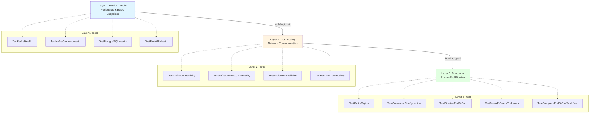
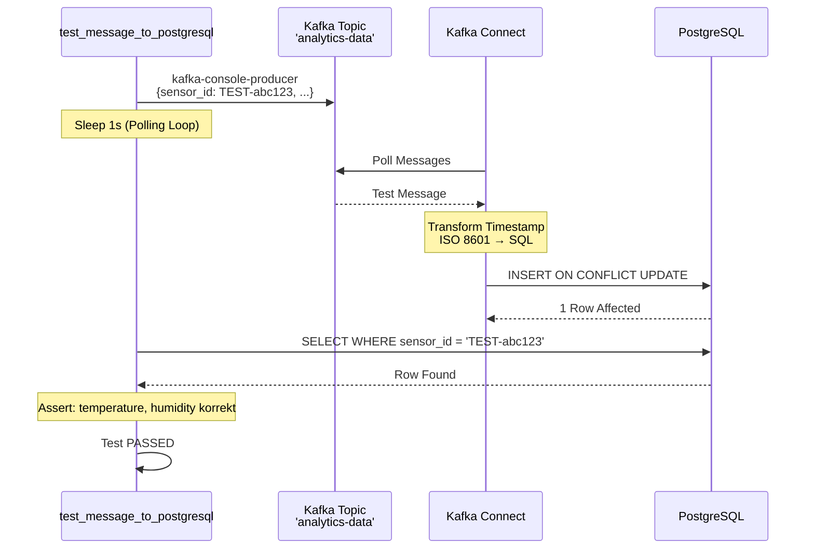

# 07 - Testing

## Übersicht

Die Test-Suite implementiert eine **3-Layer-Architektur** mit pytest: Health Checks (Layer 1), Connectivity Tests (Layer 2) und Functional/E2E Tests (Layer 3). Alle Tests laufen automatisch nach dem Deployment via `init.ps1`.

**Test-Verzeichnis:** [`tests/`](../tests/)

## Test-Architektur

### 3-Layer-Hierarchie



**Abhängigkeiten:**
- Layer 2 Tests erfordern erfolgreiche Layer 1 Tests
- Layer 3 Tests erfordern erfolgreiche Layer 1 + 2 Tests
- Innerhalb jeder Layer gibt es weitere Abhängigkeiten (via `pytest-dependency`)

## Pytest-Konfiguration

### pytest.ini

**Datei:** [`tests/pytest.ini`](../tests/pytest.ini)

```ini
[pytest]
testpaths = tests
python_files = test_*.py
python_classes = Test*
python_functions = test_*
addopts = -v --tb=short --color=yes

markers =
    health: Health check tests (Layer 1)
    connectivity: Connectivity tests (Layer 2)
    functional: Functional/Pipeline tests (Layer 3)
    slow: Tests that take longer to run
```

**Optionen erklärt:**
- **`-v`** - Verbose output (alle Tests einzeln auflisten)
- **`--tb=short`** - Kurze Traceback-Ausgabe bei Fehlern
- **`--color=yes`** - Farbige Ausgabe (grün=pass, rot=fail)

### Dependencies (requirements.txt)

**Datei:** [`tests/requirements.txt`](../tests/requirements.txt)

```txt
pytest==8.3.4
pytest-dependency==0.6.0
kubernetes==31.0.0
```

**Warum pytest-dependency?**
- Ermöglicht explizite Test-Abhängigkeiten
- Skippt abhängige Tests bei Parent-Failure
- Verhindert Cascading Failures

## Fixtures (conftest.py)

**Datei:** [`tests/conftest.py`](../tests/conftest.py)

### Session-Scope Fixtures

**Config:**
```python
@pytest.fixture(scope="session")
def config():
    """Zentrale Test-Konfiguration"""
    return {
        "namespaces": {
            "messaging": "messaging",
            "api": "api",
            "data": "data",
            "monitoring": "monitoring"
        },
        "kafka": {
            "broker_pod": "kafka-broker-0",
            "controller_pod": "kafka-controller-0",
            "topics": ["sensor-data", "analytics-data"]
        },
        "postgresql": {
            "pod": "postgresql-0",
            "database": "sensordata",
            "table": "analytics_data"
        },
        "fastapi": {
            "deployment": "fastapi",
            "service": "fastapi"
        }
    }
```

**Pod Execution:**
```python
@pytest.fixture(scope="session")
def kafka_exec(config):
    """Führt Befehle in Kafka Broker Pod aus"""
    def _exec(command):
        from kubernetes import client, config as k8s_config
        k8s_config.load_kube_config()
        v1 = client.CoreV1Api()

        resp = stream(
            v1.connect_get_namespaced_pod_exec,
            config["kafka"]["broker_pod"],
            config["namespaces"]["messaging"],
            command=command,
            stderr=True,
            stdin=False,
            stdout=True,
            tty=False
        )
        return resp
    return _exec
```

**Test Message:**
```python
import uuid

@pytest.fixture(scope="function")
def test_message():
    """Generiert eindeutige Test-Nachricht"""
    sensor_id = f"TEST-{uuid.uuid4().hex[:8]}"
    return {
        "sensor_id": sensor_id,
        "timestamp": "2025-12-14T10:00:00",
        "temperature": 25.5,
        "humidity": 60.0
    }
```

## Layer 1: Health Checks

**Datei:** [`tests/test_1_health.py`](../tests/test_1_health.py)

### TestKafkaHealth

```python
import pytest
from kubernetes import client, config

class TestKafkaHealth:
    @pytest.mark.dependency()
    def test_kafka_broker_running(self, config, get_pod_phase):
        """Prüft ob Kafka Broker Pods laufen"""
        for i in range(2):  # 2 Broker Replicas
            pod_name = f"kafka-broker-{i}"
            phase = get_pod_phase(pod_name, config["namespaces"]["messaging"])
            assert phase == "Running", f"{pod_name} not running: {phase}"

    @pytest.mark.dependency()
    def test_kafka_controller_running(self, config, get_pod_phase):
        """Prüft ob Kafka Controller Pods laufen"""
        for i in range(2):  # 2 Controller Replicas
            pod_name = f"kafka-controller-{i}"
            phase = get_pod_phase(pod_name, config["namespaces"]["messaging"])
            assert phase == "Running", f"{pod_name} not running: {phase}"

    @pytest.mark.dependency(depends=["test_kafka_broker_running"])
    def test_kafka_topics_accessible(self, kafka_exec):
        """Prüft ob Topics gelistet werden können"""
        result = kafka_exec([
            "kafka-topics.sh",
            "--bootstrap-server", "localhost:9092",
            "--list"
        ])
        assert "sensor-data" in result or "analytics-data" in result
```

### TestPostgreSQLHealth

```python
class TestPostgreSQLHealth:
    @pytest.mark.dependency()
    def test_postgresql_running(self, config, get_pod_phase):
        """Prüft ob PostgreSQL Pod läuft"""
        phase = get_pod_phase(
            config["postgresql"]["pod"],
            config["namespaces"]["data"]
        )
        assert phase == "Running"

    @pytest.mark.dependency(depends=["test_postgresql_running"])
    def test_postgresql_table_exists(self, postgres_exec, config):
        """Prüft ob analytics_data Tabelle existiert"""
        result = postgres_exec([
            "psql", "-U", "postgres", "-d", config["postgresql"]["database"],
            "-c", "\\dt analytics_data"
        ])
        assert "analytics_data" in result
```

### TestFastAPIHealth

```python
class TestFastAPIHealth:
    @pytest.mark.dependency()
    def test_fastapi_deployment_ready(self, config, get_deployment_ready_replicas):
        """Prüft ob FastAPI Deployment ready ist"""
        ready = get_deployment_ready_replicas(
            config["fastapi"]["deployment"],
            config["namespaces"]["api"]
        )
        assert ready >= 1

    @pytest.mark.dependency(depends=["test_fastapi_deployment_ready"])
    def test_fastapi_health_endpoint(self, fastapi_exec):
        """Prüft /health Endpoint"""
        result = fastapi_exec([
            "curl", "-s", "http://localhost:8000/health"
        ])
        assert "healthy" in result.lower()
```

## Layer 2: Connectivity Tests

**Datei:** [`tests/test_2_connectivity.py`](../tests/test_2_connectivity.py)

### TestKafkaConnectivity

```python
class TestKafkaConnectivity:
    @pytest.mark.dependency(depends=["test_1_health.py::TestKafkaHealth::test_kafka_broker_running"])
    def test_broker_to_broker(self, kafka_exec):
        """Prüft Inter-Broker Kommunikation"""
        # TCP-Verbindung zu kafka-broker-1
        result = kafka_exec([
            "nc", "-zv",
            "kafka-broker-1.kafka-broker.messaging.svc.cluster.local",
            "19092"
        ])
        assert "succeeded" in result.lower() or "open" in result.lower()

    @pytest.mark.dependency()
    def test_broker_to_controller(self, kafka_exec):
        """Prüft Broker→Controller Kommunikation"""
        result = kafka_exec([
            "nc", "-zv",
            "kafka-controller-0.kafka-controller.messaging.svc.cluster.local",
            "9093"
        ])
        assert "succeeded" in result.lower() or "open" in result.lower()
```

### TestFastAPIConnectivity

```python
class TestFastAPIConnectivity:
    @pytest.mark.dependency()
    def test_fastapi_to_kafka(self, fastapi_exec):
        """Prüft FastAPI→Kafka Verbindung"""
        result = fastapi_exec([
            "nc", "-zv",
            "kafka.messaging.svc.cluster.local",
            "9092"
        ])
        assert "succeeded" in result.lower() or "open" in result.lower()

    @pytest.mark.dependency()
    def test_fastapi_to_postgresql(self, fastapi_exec):
        """Prüft FastAPI→PostgreSQL Verbindung"""
        result = fastapi_exec([
            "nc", "-zv",
            "postgresql.data.svc.cluster.local",
            "5432"
        ])
        assert "succeeded" in result.lower() or "open" in result.lower()
```

## Layer 3: Functional Tests

**Datei:** [`tests/test_3_functional.py`](../tests/test_3_functional.py)

### TestPipelineEndToEnd

**Kritischer Test:** Validiert vollständige Daten-Pipeline

```python
import json
import time

class TestPipelineEndToEnd:
    @pytest.mark.dependency()
    @pytest.mark.slow
    def test_message_to_postgresql(
        self,
        kafka_exec,
        postgres_exec,
        test_message,
        config
    ):
        """
        End-to-End Test: Kafka Topic → PostgreSQL

        Flow:
        1. Send message to analytics-data topic
        2. Kafka Connect consumes message
        3. JDBC Sink writes to PostgreSQL
        4. Verify data in analytics_data table
        """
        # 1. Send Test Message zu Kafka
        message_json = json.dumps(test_message)
        kafka_exec([
            "bash", "-c",
            f"echo '{message_json}' | kafka-console-producer.sh "
            f"--bootstrap-server localhost:9092 "
            f"--topic analytics-data"
        ])

        # 2. Warte auf Kafka Connect Processing (max 15s)
        max_wait = 15
        found = False

        for i in range(max_wait):
            time.sleep(1)

            # 3. Prüfe PostgreSQL
            query = f"""
                SELECT sensor_id, temperature, humidity
                FROM analytics_data
                WHERE sensor_id = '{test_message["sensor_id"]}'
            """

            result = postgres_exec([
                "psql", "-U", "appuser", "-d", config["postgresql"]["database"],
                "-t", "-c", query
            ])

            if test_message["sensor_id"] in result:
                found = True

                # 4. Verify Data Integrity
                assert str(test_message["temperature"]) in result
                assert str(test_message["humidity"]) in result
                break

        assert found, f"Message nicht in PostgreSQL nach {max_wait}s"
```

**Ablauf-Diagramm:**



### TestFastAPIQueryEndpoints

```python
class TestFastAPIQueryEndpoints:
    @pytest.mark.dependency()
    def test_get_sensors(self, fastapi_exec):
        """Prüft /sensors Endpoint"""
        result = fastapi_exec([
            "curl", "-s", "http://localhost:8000/sensors?limit=10"
        ])

        # Parse JSON Response
        data = json.loads(result)
        assert "sensors" in data
        assert isinstance(data["sensors"], list)

    @pytest.mark.dependency()
    def test_get_sensor_data(self, fastapi_exec, config):
        """Prüft /sensors/{id}/data Endpoint"""
        # Verwende bekannte Sensor-ID (aus vorherigem Test)
        result = fastapi_exec([
            "curl", "-s",
            "http://localhost:8000/sensors/SENSOR-001/data?limit=5"
        ])

        data = json.loads(result)
        assert "data" in data
        assert isinstance(data["data"], list)

    @pytest.mark.dependency()
    def test_get_sensor_stats(self, fastapi_exec):
        """Prüft /sensors/{id}/stats Endpoint"""
        result = fastapi_exec([
            "curl", "-s",
            "http://localhost:8000/sensors/SENSOR-001/stats"
        ])

        data = json.loads(result)
        assert "temperature" in data
        assert "humidity" in data
        assert "min" in data["temperature"]
        assert "max" in data["temperature"]
        assert "avg" in data["temperature"]
```

### TestCompleteEndToEndWorkflow

```python
class TestCompleteEndToEndWorkflow:
    @pytest.mark.dependency(depends=[
        "TestPipelineEndToEnd::test_message_to_postgresql",
        "TestFastAPIQueryEndpoints::test_get_sensors"
    ])
    @pytest.mark.slow
    def test_full_data_consistency(
        self,
        kafka_exec,
        postgres_exec,
        fastapi_exec,
        config
    ):
        """
        Vollständiger Konsistenz-Test

        Vergleicht Daten-Counts zwischen:
        - Kafka Topic (sensor-data)
        - Kafka Topic (analytics-data)
        - PostgreSQL Tabelle (analytics_data)
        """
        # 1. Count sensor-data Messages
        result = kafka_exec([
            "kafka-run-class.sh", "kafka.tools.GetOffsetShell",
            "--broker-list", "localhost:9092",
            "--topic", "sensor-data",
            "--time", "-1"
        ])
        sensor_data_count = self._parse_offset(result)

        # 2. Count analytics-data Messages
        result = kafka_exec([
            "kafka-run-class.sh", "kafka.tools.GetOffsetShell",
            "--broker-list", "localhost:9092",
            "--topic", "analytics-data",
            "--time", "-1"
        ])
        analytics_data_count = self._parse_offset(result)

        # 3. Count PostgreSQL Rows
        result = postgres_exec([
            "psql", "-U", "appuser", "-d", config["postgresql"]["database"],
            "-t", "-c", "SELECT COUNT(*) FROM analytics_data"
        ])
        pg_count = int(result.strip())

        # 4. Assertions
        assert analytics_data_count > 0, "Keine analytics-data Messages"
        assert pg_count > 0, "Keine PostgreSQL Rows"

        # Kafka Connect sollte alle analytics-data Messages geschrieben haben
        # (mit Toleranz für Race Conditions)
        assert pg_count >= analytics_data_count * 0.9, \
            f"PostgreSQL Count ({pg_count}) << Kafka Count ({analytics_data_count})"

    def _parse_offset(self, output):
        """Parst Kafka Offset aus GetOffsetShell Output"""
        # Output: "sensor-data:0:12345"
        for line in output.split('\n'):
            if ':' in line:
                parts = line.split(':')
                if len(parts) >= 3:
                    return int(parts[2])
        return 0
```

## Test-Ausführung

### Manuelle Ausführung

```powershell
# Alle Tests
pytest tests/ -v

# Einzelne Layer
pytest tests/test_1_health.py -v
pytest tests/test_2_connectivity.py -v
pytest tests/test_3_functional.py -v

# Nach Markern
pytest tests/ -m health
pytest tests/ -m "functional and not slow"

# Einzelne Test-Klasse
pytest tests/test_1_health.py::TestKafkaHealth -v

# Einzelner Test
pytest tests/test_3_functional.py::TestPipelineEndToEnd::test_message_to_postgresql -v
```

### Automatische Ausführung (init.ps1)

```powershell
Set-Location "$initScriptRoot/tests"
pytest test_1_health.py -v --tb=short
pytest test_2_connectivity.py -v --tb=short
pytest test_3_functional.py -v --tb=short
```

**Warum sequenziell?**
- Layer-Abhängigkeiten erzwingen
- Bessere Fehler-Lokalisierung
- Vermeidung von Ressourcen-Konflikten

## Test-Output

### Erfolgreiche Test-Suite

```
============================= test session starts ==============================
collected 25 items

tests/test_1_health.py::TestKafkaHealth::test_kafka_broker_running PASSED  [ 4%]
tests/test_1_health.py::TestKafkaHealth::test_kafka_controller_running PASSED [ 8%]
tests/test_1_health.py::TestKafkaHealth::test_kafka_topics_accessible PASSED [12%]
...
tests/test_3_functional.py::TestPipelineEndToEnd::test_message_to_postgresql PASSED [96%]
tests/test_3_functional.py::TestCompleteEndToEndWorkflow::test_full_data_consistency PASSED [100%]

============================== 25 passed in 45.23s ==============================
```

### Fehlgeschlagener Test

```
FAILED tests/test_2_connectivity.py::TestKafkaConnectivity::test_broker_to_broker - AssertionError: nc: connect to kafka-broker-1... failed: Connection refused

Short test summary:
FAILED tests/test_2_connectivity.py::TestKafkaConnectivity::test_broker_to_broker

1 failed, 10 passed, 14 skipped in 12.34s
```

**Skipped Tests:** Abhängige Tests werden automatisch übersprungen bei Parent-Failure

## Best Practices

### 1. Dependency Management

```python
# Explizite Abhängigkeiten deklarieren
@pytest.mark.dependency(depends=["test_pod_running"])
def test_service_responds(self):
    # Nur ausführen wenn test_pod_running erfolgreich
    pass
```

### 2. Unique Test Data

```python
# UUID für eindeutige Sensor-IDs
import uuid
sensor_id = f"TEST-{uuid.uuid4().hex[:8]}"
```

**Warum?** Vermeidet Konflikte bei parallelen Tests oder wiederholten Ausführungen

### 3. Polling mit Timeout

```python
# Nicht: time.sleep(30)  # Zu langsam
# Sondern:
for i in range(max_wait):
    if condition_met():
        break
    time.sleep(1)
else:
    pytest.fail("Timeout erreicht")
```

### 4. Error Messages

```python
# Schlechte Fehlermeldung
assert found

# Gute Fehlermeldung
assert found, f"Sensor {sensor_id} nicht in PostgreSQL nach {max_wait}s"
```

## Troubleshooting Tests

### Problem: Tests hängen

```powershell
# Timeout setzen
pytest tests/ -v --timeout=60

# Oder einzelnen Test abbrechen
Ctrl+C
```

### Problem: Fixture Not Found

```bash
# conftest.py im richtigen Verzeichnis?
tests/
  conftest.py  # ✅ Session-scope
  test_1_health.py
```

### Problem: Kubernetes Connection Failed

```python
# In conftest.py: Prüfe Kube Config
from kubernetes import config
config.load_kube_config()  # Kann feilen wenn Cluster nicht erreichbar

# Debug:
kubectl cluster-info
```

### Problem: Dependency Violations

```
SKIPPED tests/test_2_connectivity.py::TestKafkaConnectivity::test_broker_to_broker
Reason: test_1_health.py::TestKafkaHealth::test_kafka_broker_running dependency failed
```

**Lösung:** Behebe Parent-Test zuerst

## Weiterführende Dokumentation

- **[06 - Deployment](06-Deployment.md)** - Test-Ausführung in init.ps1
- **[08 - Troubleshooting](08-Troubleshooting.md)** - Debug-Strategien
- **[pytest Documentation](https://docs.pytest.org/)**
- **[pytest-dependency](https://pytest-dependency.readthedocs.io/)**

---

**Navigation:** [← Zurück zu Deployment](06-Deployment.md) | [Weiter zu Troubleshooting →](08-Troubleshooting.md)
