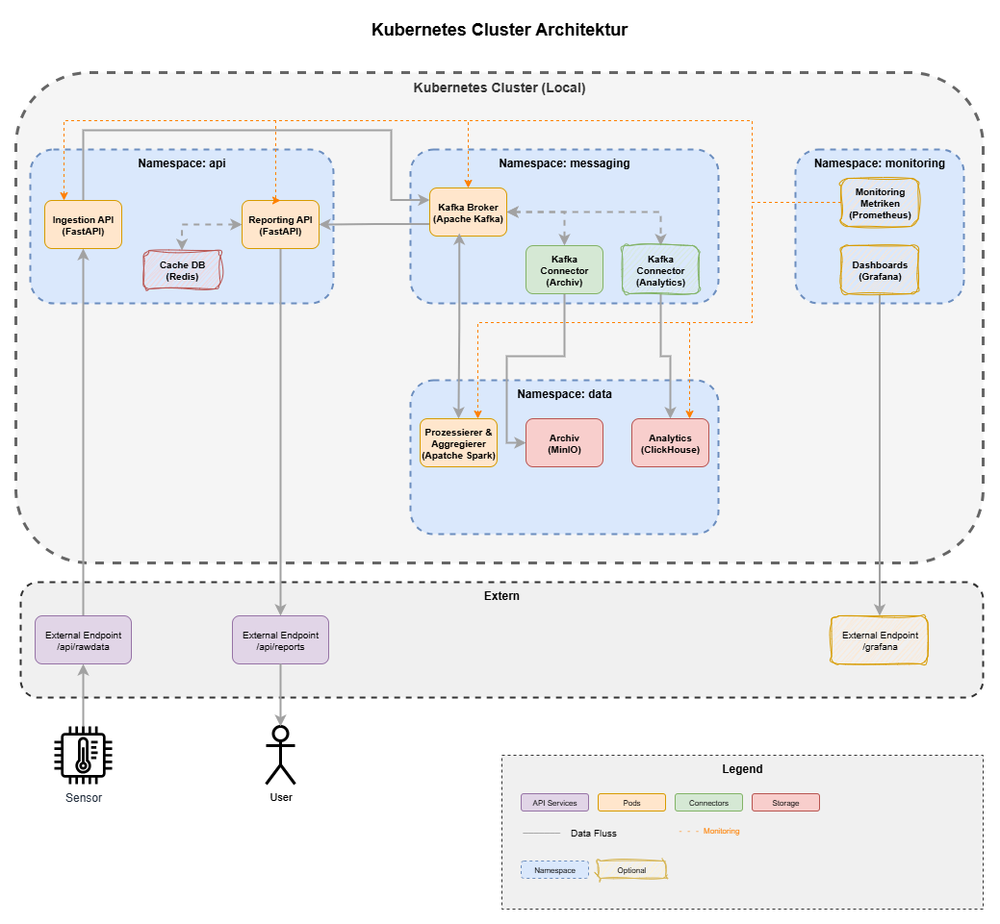
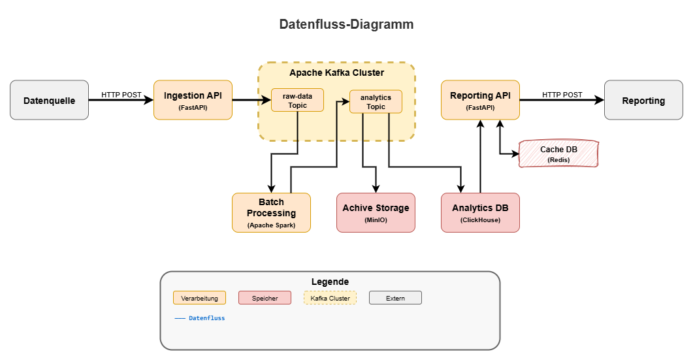
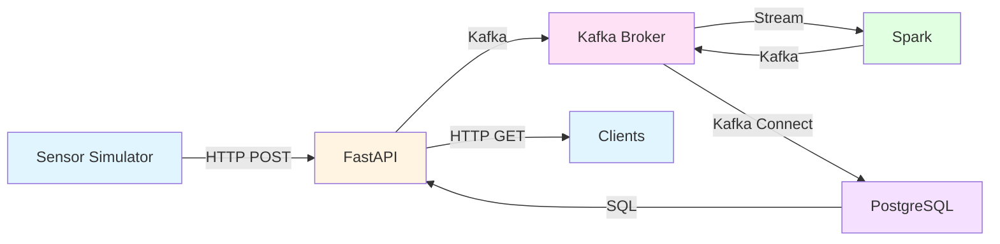
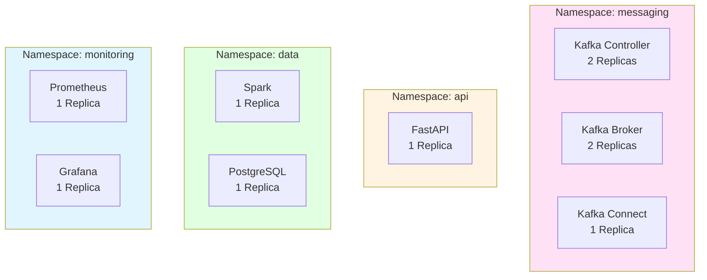
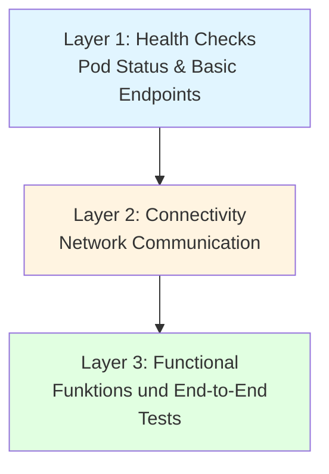

# DLMDWWDE02 - Data Engineering System

## 📋 Übersicht

Dieses Master-Projekt ist ein **produktionsreifes Kubernetes-basiertes Data Engineering System** für Echtzeit-Datenverarbeitung mit vollständigem Monitoring, automatisierten Tests und umfassender Dokumentation.

Das System implementiert eine **Microservices-Architektur** mit strikter Namespace-Isolation und verarbeitet simulierte Sensor-Daten in Echtzeit über eine vollständige Pipeline: Ingestion → Streaming → Aggregation → Speicherung → Abfrage.

### Systemarchitektur



### Datenfluss



## 🎯 Kernfunktionalität



**Pipeline-Schritte:**
1. **Python Simulator** generiert Sensor-Daten (Temperatur, Luftfeuchtigkeit)
2. **FastAPI** nimmt Daten via REST API entgegen und schreibt in Kafka
3. **Apache Spark** liest Kafka-Stream, aggregiert Daten in 30-Sekunden-Fenstern
4. **Kafka Connect** schreibt aggregierte Daten in PostgreSQL
5. **FastAPI Query API** stellt Daten über REST zur Verfügung
6. **Prometheus + Grafana** überwachen das gesamte System

## 📚 Dokumentationsstruktur

Diese Dokumentation ist modular aufgebaut. Jedes Modul behandelt einen spezifischen Systembereich:

### Infrastruktur & Basis
- **[01 - Infrastruktur](01-Infrastruktur.md)** - Kubernetes/Kind Setup, Namespace-Architektur, Helm Charts

### Komponenten
- **[02 - Kafka Messaging](02-Kafka-Messaging.md)** - Kafka KRaft Mode, Topics, Broker-Konfiguration
- **[03 - Data Processing](03-Data-Processing.md)** - Spark Streaming, PostgreSQL, Kafka Connect
- **[04 - API Layer](04-API-Layer.md)** - FastAPI Endpoints, Ingress, Request/Response Schemas
- **[05 - Monitoring](05-Monitoring.md)** - Prometheus, Grafana Dashboards, Metriken

### Betrieb
- **[06 - Deployment](06-Deployment.md)** - Installation, Updates, Build-Prozesse
- **[07 - Testing](07-Testing.md)** - Test-Architektur, pytest Suite, E2E Tests
- **[08 - Troubleshooting](08-Troubleshooting.md)** - Debugging, Häufige Fehler, Logs

## 🚀 Quick Start

### Voraussetzungen

- Windows 10/11 mit PowerShell
- [Podman Desktop](https://podman-desktop.io/) installiert
- Mindestens 8 GB RAM verfügbar
- 20 GB freier Festplattenspeicher

### Installation (15-20 Minuten)

```powershell
# 1. Repository klonen
git clone https://github.com/Kokoloris19097/DLMDWWDE02.git
cd DLMDWWDE02

# 2. PowerShell Execution Policy setzen
Set-ExecutionPolicy -ExecutionPolicy Unrestricted -Scope CurrentUser

# 3. System installieren
.\init.ps1
```

Das Skript führt automatisch durch:
- ✅ Installation von Kind, Kubectl, Helm (falls nicht vorhanden)
- ✅ Podman VM Start
- ✅ Kubernetes Cluster Erstellung
- ✅ Image Builds (FastAPI, Spark, PostgreSQL Connector)
- ✅ Helm Deployment (4 Namespaces, 10+ Pods)
- ✅ Automatisierte Tests
- ✅ Port-Forwarding Start
- ✅ Sensor Simulator Start

### Zugriff auf Services

Nach erfolgreicher Installation sind folgende Services verfügbar:

| Service | URL | Beschreibung |
|---------|-----|--------------|
| **FastAPI Swagger UI** | http://localhost:8000/docs | API Dokumentation & Testing |
| **FastAPI Health** | http://localhost:8000/health | Service Health Check |
| **Grafana** | http://localhost:3000 | Monitoring Dashboards (admin/admin) |


## 🏗️ Systemkomponenten

### Kubernetes Namespaces



### Technologie-Stack

| Kategorie | Technologie | Version | Zweck |
|-----------|-------------|---------|-------|
| **Orchestrierung** | Kubernetes (Kind) | 1.31 | Container-Orchestrierung |
| **Messaging** | Apache Kafka | 4.1.0 | Event Streaming (KRaft Mode) |
| **Processing** | Apache Spark | 3.5.7 | Stream Processing & Aggregation |
| **Database** | PostgreSQL | 16-alpine | Analytics-Datenbank |
| **API** | FastAPI | 2.0.0 | REST API (Ingestion + Query) |
| **Monitoring** | Prometheus | 3.7.1 | Metriken-Sammlung |
| **Visualization** | Grafana | 11.4.0 | Dashboard & Alerting |
| **Ingress** | NGINX | 4.11.3 | External Access |
| **Integration** | Kafka Connect | 7.5.0 | JDBC Sink Connector |

## 📊 Monitoring & Observability

### Grafana Dashboards

Das System enthält 5 vorkonfigurierte Dashboards:

1. **Cluster Resources** - CPU, Memory, Storage Übersicht
2. **API Namespace** - FastAPI Metriken & Performance
3. **Messaging Namespace** - Kafka Broker & Connect Metriken
4. **Data Namespace** - Spark & PostgreSQL Metriken
5. **Monitoring Namespace** - Prometheus & Grafana Metriken

Dashboard-Konfigurationen: [`helm-charts/system-cluster/grafana/`](../helm-charts/system-cluster/grafana/)

### Prometheus Metriken

- **Scrape Interval:** 15 Sekunden
- **Retention:** 15 Tage
- **Storage:** 10 GB PersistentVolume
- **Targets:** Kubernetes API, cAdvisor, Kubelet

## 🧪 Testing

### 3-Layer Test-Architektur



**Test-Ausführung:**
```powershell
# Alle Tests
pytest tests/ -v

# Einzelne Layer
pytest tests/test_1_health.py -v
pytest tests/test_2_connectivity.py -v
pytest tests/test_3_functional.py -v
```

Siehe: **[07 - Testing](07-Testing.md)** für Details

## 🔧 Konfiguration

### Helm Values

Zentrale Konfiguration: [`helm-charts/system-cluster/values.yaml`](../helm-charts/system-cluster/values.yaml)


### Ressourcen-Anforderungen

| Component | CPU Request | Memory Request | CPU Limit | Memory Limit |
|-----------|-------------|----------------|-----------|--------------|
| Kafka Broker | 1000m | 2Gi | 2000m | 4Gi |
| Kafka Controller | 500m | 1Gi | 1000m | 2Gi |
| Spark | 1000m | 2Gi | 2000m | 4Gi |
| PostgreSQL | 250m | 512Mi | 500m | 1Gi |
| FastAPI | 250m | 256Mi | 500m | 512Mi |
| Prometheus | 500m | 1Gi | 2000m | 4Gi |
| Grafana | 250m | 512Mi | 1000m | 2Gi |

**Gesamt:** ~3.75 CPU Cores, ~8 GB RAM (Requests)

## 🔒 Sicherheit & Governance

### Aktuelle Implementierung (Development)

- ✅ Namespace-Isolation
- ✅ Service-to-Service Kommunikation via Cluster DNS
- ✅ Passwort-geschützte PostgreSQL
- ⚠️ **Keine TLS/SSL** (nur localhost)
- ⚠️ **Keine Authentifizierung** an FastAPI API

### Produktions-Anforderungen

Für Produktionsumgebungen erforderlich:
- TLS/SSL für alle externen APIs (HTTPS), hierzu kann der vorkonfigurierte Ingress konfiguriert werden
- API Authentication (OAuth2/JWT)
- Kafka SASL/SSL für interne Kommunikation
- Network Policies für Namespace-Isolation
- RBAC für Kubernetes-Zugriff
- Secret Management (z.B. Vault), darin müssten die Passwörter sicher gespeichert werden welche aktuell unsicher in den Helm Values liegen


## 🗂️ Datenarchivierung

### Storage-Strategie

- **PostgreSQL:** Hot Data (letzte 30 Tage, konfigurierbar)
- **Kafka Retention:** 7 Tage (Topic-Level)
- **Prometheus:** 15 Tage Metriken
- **Grafana:** 5 GB Dashboards & Annotations

### Backup-Strategie

- PostgreSQL PVC Snapshots (täglich)
- Kafka Topic Export zu S3/MinIO (wöchentlich)
- Prometheus Remote Write zu Langzeit-Storage

## 🎓 Weiterführende Ressourcen

### Projekt-Dokumentation

- [tests/README.md](../tests/README.md) - Test-Dokumentation
- [simulator/README.md](../simulator/README.md) - Simulator-Nutzung

### Externe Dokumentation

- [Apache Kafka Documentation](https://kafka.apache.org/documentation/)
- [Apache Spark Structured Streaming](https://spark.apache.org/docs/latest/structured-streaming-programming-guide.html)
- [FastAPI Documentation](https://fastapi.tiangolo.com/)
- [Kubernetes Documentation](https://kubernetes.io/docs/)
- [Helm Documentation](https://helm.sh/docs/)

## 💡 Häufige Fragen (FAQ)

### Warum PostgreSQL statt ClickHouse/MinIO?

**Antwort:** Ressourcen-Optimierung für lokale Entwicklung. PostgreSQL benötigt ~512 MB RAM vs. ClickHouse (~2 GB) + MinIO (~1 GB). Für Produktion mit OLAP-Workloads wäre ClickHouse + MinIO die bessere Wahl.

### Warum Kafka KRaft Mode?

**Antwort:** Vereinfachte Architektur (keine separate ZooKeeper-Installation), bessere Performance für Metadata-Operationen, zukunftssicher (ZooKeeper-Modus wird deprecated ab Kafka 4.0).

### Wie lange dauert das Deployment?

**Antwort:** 15-20 Minuten auf einem Laptop mit 32 GB RAM und SSD.

### Kann ich das System auf Linux/Mac nutzen?

**Antwort:** Die PowerShell-Skripte sind Windows-spezifisch. Für Linux/Mac müssen die Skripte in Bash/sh portiert werden. Die Kubernetes-Manifeste (Helm Charts) sind plattformunabhängig. Alternativ kann auch Powershell Core auf Linux/Mac genutzt werden.

### Wie kann ich die Anzahl der Sensoren ändern?

**Antwort:** Der Simulator wird mit `--sensors` Parameter gestartet:
```powershell
python simulator/sensor_simulator.py --sensors 50 --interval 0.5
```

### Wo finde ich die Logs?

**Antwort:**
```powershell
kubectl logs <pod-name> -n <namespace> -f
```

---

**Zuletzt aktualisiert:** 14. Dezember 2025
