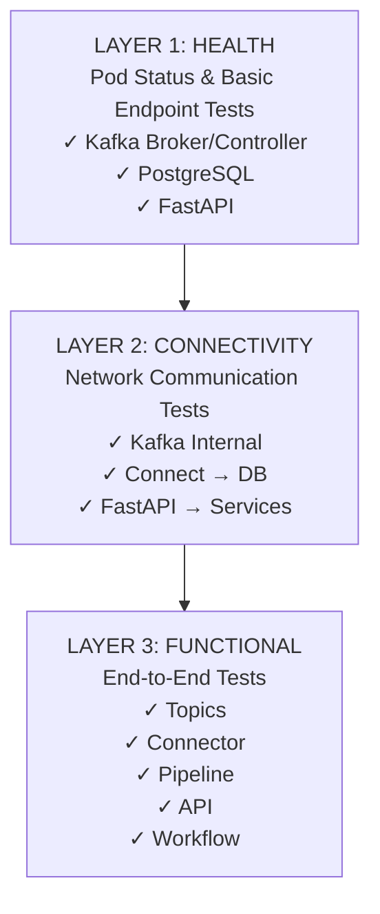

# Test Suite Documentation

## Übersicht

Diese Test-Suite implementiert eine **3-stufige Hierarchie** für umfassende Integration Tests eines Kubernetes-basierten Data Engineering Systems. Die Tests validieren die vollständige Pipeline von Kafka über PostgreSQL bis zur FastAPI.

### Architektur


Eine detaillierte Visualisierung der Test-Abhängigkeiten finden Sie in [dependency_graph.md](dependency_graph.md).
---

## Testdateien

| Datei | Beschreibung |
|-------|--------------|
| `test_1_health.py` |  Layer 1 - Pod Health & Basic Endpoint Tests |
| `test_2_connectivity.py` | Layer 2 - Network Connectivity Tests |
| `test_3_function.py` | Layer 3 - Functional Pipeline & API Tests |
| `conftest.py` | Pytest Fixtures & Configuration |
| `pytest.ini` | Pytest Configuration |

---

## test_1_health.py - Layer 1: Health Checks

### Zweck
Validiert, dass alle Kubernetes Pods laufen und ihre grundlegenden Endpoints erreichbar sind. Diese Tests bilden die **Foundation** für alle weiteren Tests.

### Test Classes

#### 1A: TestKafkaHealth
**Kafka Cluster Health Checks**

| Test | Dependency Name | Dependencies | Beschreibung |
|------|-----------------|--------------|--------------|
| `test_kafka_broker_0_running` | `kafka_broker_0_running` | - | Prüft ob kafka-broker-0 Pod läuft |
| `test_kafka_broker_1_running` | `kafka_broker_1_running` | - | Prüft ob kafka-broker-1 Pod läuft |
| `test_kafka_controller_0_running` | `kafka_controller_0_running` | - | Prüft ob kafka-controller-0 Pod läuft |
| `test_kafka_controller_1_running` | `kafka_controller_1_running` | - | Prüft ob kafka-controller-1 Pod läuft |
| `test_kafka_topics_accessible` | `kafka_topics_accessible` | `kafka_broker_0_running` | Prüft ob Topics gelistet werden können |

#### 1B: TestKafkaConnectHealth
**Kafka Connect Deployment Health**

| Test | Dependency Name | Dependencies | Beschreibung |
|------|-----------------|--------------|--------------|
| `test_kafka_connect_running` | `kafka_connect_running` | `kafka_broker_0_running`, `kafka_broker_1_running` | Prüft ob Kafka Connect Deployment läuft |
| `test_kafka_connect_api_available` | `kafka_connect_api_available` | `kafka_connect_running` | Prüft ob Connect REST API antwortet |
| `test_postgresql_sink_connector_exists` | `postgresql_sink_connector_exists` | `kafka_connect_api_available` | Prüft ob postgresql-sink Connector registriert ist |
| `test_postgresql_sink_connector_running` | `postgresql_sink_connector_running` | `postgresql_sink_connector_exists` | Prüft ob Connector und Task im Status RUNNING sind |

#### 1C: TestPostgreSQLHealth
**PostgreSQL Database Health**

| Test | Dependency Name | Dependencies | Beschreibung |
|------|-----------------|--------------|--------------|
| `test_postgresql_running` | `postgresql_running` | - | Prüft ob PostgreSQL Pod läuft |
| `test_postgresql_accepting_connections` | `postgresql_accepting_connections` | `postgresql_running` | Prüft ob PostgreSQL Verbindungen akzeptiert |
| `test_analytics_data_table_exists` | `analytics_data_table_exists` | `postgresql_accepting_connections` | Prüft ob analytics_data Tabelle existiert |

#### 1D: TestFastAPIHealth
**FastAPI Application Health**

| Test | Dependency Name | Dependencies | Beschreibung |
|------|-----------------|--------------|--------------|
| `test_fastapi_running` | `fastapi_running` | `kafka_broker_0_running` | Prüft ob FastAPI Pod läuft |
| `test_fastapi_health_endpoint` | `fastapi_health_endpoint` | `fastapi_running` | Prüft `/health` Endpoint (HTTP 200) |
| `test_fastapi_ready_endpoint` | `fastapi_ready_endpoint` | `fastapi_health_endpoint` | Prüft `/ready` Endpoint (HTTP 200) |

---

## test_2_connectivity.py - Layer 2: Connectivity

### Zweck
Validiert Netzwerk-Verbindungen zwischen allen Komponenten. Diese Tests hängen von den entsprechenden Health Checks ab.

### Test Classes

#### 2A: TestKafkaConnectivity
**Kafka Internal Network Connectivity**

| Test | Dependency Name | Dependencies | Beschreibung |
|------|-----------------|--------------|--------------|
| `test_broker_to_controller_0` | `broker_to_controller_0` | `kafka_broker_0_running`, `kafka_controller_0_running` | TCP Check: Broker → Controller-0:9093 |
| `test_broker_to_controller_1` | `broker_to_controller_1` | `kafka_broker_0_running`, `kafka_controller_1_running` | TCP Check: Broker → Controller-1:9093 |
| `test_broker_0_to_broker_1` | `broker_0_to_broker_1` | `kafka_broker_0_running`, `kafka_broker_1_running` | TCP Check: Broker-0 → Broker-1:9092 |

#### 2B: TestKafkaConnectConnectivity
**Kafka Connect Network Connectivity**

| Test | Dependency Name | Dependencies | Beschreibung |
|------|-----------------|--------------|--------------|
| `test_connect_to_kafka_broker` | `connect_to_kafka_broker` | `kafka_connect_running`, `kafka_broker_0_running` | TCP Check: Connect → Kafka:9092 |
| `test_connect_to_postgresql` | `connect_to_postgresql` | `kafka_connect_running`, `postgresql_running` | TCP Check: Connect → PostgreSQL:5432 |

#### 2C: TestEndpointsAvailable
**Kubernetes Service Endpoints**

| Test | Dependency Name | Dependencies | Beschreibung |
|------|-----------------|--------------|--------------|
| `test_kafka_broker_endpoints` | `kafka_broker_endpoints` | `kafka_broker_0_running`, `kafka_broker_1_running` | Prüft kafka-broker Service Endpoints |
| `test_kafka_controller_endpoints` | `kafka_controller_endpoints` | `kafka_controller_0_running`, `kafka_controller_1_running` | Prüft kafka-controller Service Endpoints |
| `test_postgresql_endpoints` | `postgresql_endpoints` | `postgresql_running` | Prüft postgresql Service Endpoints |

#### 2D: TestFastAPIConnectivity
**FastAPI Network Connectivity**

| Test | Dependency Name | Dependencies | Beschreibung |
|------|-----------------|--------------|--------------|
| `test_fastapi_to_kafka_broker` | `fastapi_to_kafka_broker` | `fastapi_running`, `kafka_broker_0_running` | TCP Check: FastAPI → Kafka:9092 |
| `test_fastapi_to_postgresql` | `fastapi_to_postgresql` | `fastapi_running`, `postgresql_running` | TCP Check: FastAPI → PostgreSQL:5432 |
| `test_fastapi_db_connection` | `fastapi_db_connection` | `fastapi_to_postgresql` | DB Connection: FastAPI → PostgreSQL (psql) |

---

## test_3_pipeline.py - Layer 3: Functional

### Zweck
Validiert die vollständige Funktionalität der Pipeline von Kafka bis FastAPI. Tests sind aufsteigend nach Komplexität geordnet: Basis → Integration → End-to-End.

### Test Classes

#### 3A: TestKafkaTopics
**Kafka Topic Configuration Tests**

| Test | Dependency Name | Dependencies | Beschreibung |
|------|-----------------|--------------|--------------|
| `test_topic_exists` | `topic_exists` | `kafka_topics_accessible` | Prüft ob analytics-data Topic existiert |
| `test_topic_configuration` | `topic_configuration` | `topic_exists` | Prüft Topic Config (Replication Factor: 2) |

#### 3B: TestConnectorConfiguration
**Kafka Connect Connector Configuration**

| Test | Dependency Name | Dependencies | Beschreibung |
|------|-----------------|--------------|--------------|
| `test_connector_config_valid` | `connector_config_valid` | `kafka_connect_api_available` | Prüft Connector Config (schemas.enable, pk.mode, transforms) |

#### 3C: TestPipelineEndToEnd
**Kafka → PostgreSQL Pipeline Tests**

| Test | Dependency Name | Dependencies | Beschreibung |
|------|-----------------|--------------|--------------|
| `test_message_to_postgresql` | `message_to_postgresql` | `topic_exists`, `postgresql_sink_connector_running`, `connect_to_kafka_broker`, `connect_to_postgresql`, `analytics_data_table_exists` | **End-to-End:** Sendet Nachricht an Kafka, wartet auf PostgreSQL Insert, validiert Datenintegrität |

**Helper Methods:**
- `_verify_connector_running()` - Prüft Connector Status
- `_send_kafka_message()` - Sendet Test-Nachricht via kafka-console-producer
- `_wait_for_message()` - Wartet bis Nachricht in PostgreSQL erscheint (max 15s)
- `_verify_data_integrity()` - Validiert Temperature/Humidity Werte

#### 3D: TestFastAPIQueryEndpoints
**FastAPI Query Endpoint Tests**

| Test | Dependency Name | Dependencies | Beschreibung |
|------|-----------------|--------------|--------------|
| `test_list_sensors` | `list_sensors` | `fastapi_ready_endpoint`, `analytics_data_table_exists` | GET `/sensors` - Listet alle Sensoren |
| `test_list_sensors_with_limit` | - | `fastapi_ready_endpoint` | GET `/sensors?limit=5` - Pagination Test |
| `test_get_sensor_data` | `get_sensor_data` | `list_sensors` | GET `/sensors/{id}/data` - Zeitreihen-Daten |
| `test_get_sensor_data_with_time_range` | - | `list_sensors` | GET `/sensors/{id}/data?start=...&end=...` - Time Range Filter |
| `test_get_sensor_data_with_limit` | - | `list_sensors` | GET `/sensors/{id}/data?limit=10` - Limit Parameter |
| `test_get_sensor_data_nonexistent_sensor` | - | `fastapi_ready_endpoint` | GET `/sensors/NONEXISTENT-999/data` - Leere Liste |
| `test_get_sensor_stats` | `get_sensor_stats` | `list_sensors` | GET `/sensors/{id}/stats` - Aggregierte Statistiken |
| `test_get_sensor_stats_with_time_range` | - | `list_sensors` | GET `/sensors/{id}/stats?start=...&end=...` - Stats Time Range |
| `test_get_sensor_stats_nonexistent_sensor` | - | `fastapi_ready_endpoint` | GET `/sensors/NONEXISTENT-999/stats` - HTTP 404 |

**Validierungen:**
- JSON Response Structure (sensor_id, timestamp, temperature, humidity)
- Statistische Bereiche (min ≤ avg ≤ max)
- HTTP Status Codes (200, 404)
- Pagination Limits

#### 3E: TestCompleteEndToEndWorkflow
**Complete Pipeline Workflow**

| Test | Dependency Name | Dependencies | Beschreibung |
|------|-----------------|--------------|--------------|
| `test_complete_workflow` | - | `message_to_postgresql`, `list_sensors`, `get_sensor_data`, `get_sensor_stats` | **Vollständiger End-to-End Test:** Listet Sensoren → Abruft Daten → Abruft Stats → Validiert Konsistenz zwischen Endpoints |

**Konsistenz-Prüfungen:**
- Stats Reading Count ≥ Data Count
- Alle Datenpunkte innerhalb Stats Min/Max Range
- Temperature/Humidity Ranges validiert

---

## Pytest Configuration

### pytest.ini

```ini
[pytest]
testpaths = tests
python_files = test_*.py
python_classes = Test*
python_functions = test_*
addopts = -v --tb=short --color=yes
markers =
    health: Health check tests
    connectivity: Connectivity tests
    functional: Functional/Pipeline tests
    slow: Tests that take longer to run
```

### Test Markers

| Marker | Beschreibung | Verwendung |
|--------|--------------|------------|
| `@pytest.mark.health` | Layer 1 - Health Checks | Pod Status, Basic Endpoints |
| `@pytest.mark.connectivity` | Layer 2 - Connectivity | Network TCP Checks |
| `@pytest.mark.functional` | Layer 3 - Functional | Pipeline, API, Integration |
| `@pytest.mark.slow` | Langlaufende Tests | End-to-End Tests mit Wartezeiten |

---

## Fixtures (conftest.py)

### Configuration Fixture

```python
@pytest.fixture(scope="session")
def config() -> TestConfig
```

**Bereitgestellte Konstanten:**
- `MESSAGING_NAMESPACE = "messaging"`
- `DATA_NAMESPACE = "data"`
- `API_NAMESPACE = "api"`
- `KAFKA_TOPIC = "analytics-data"`
- `POSTGRESQL_DB = "sensordata"`
- `POSTGRESQL_TABLE = "analytics_data"`
- `COMMAND_TIMEOUT = 30`

### Execution Fixtures

| Fixture | Scope | Beschreibung |
|---------|-------|--------------|
| `kafka_exec` | session | Führt Befehle in kafka-broker-0 Pod aus |
| `connect_exec` | session | Führt Befehle in kafka-connect Pod aus (via selector) |
| `postgres_exec` | session | Führt Befehle in postgresql-0 Pod aus |
| `fastapi_exec` | session | Führt Befehle in FastAPI Pod aus (via selector) |

### Helper Fixtures

| Fixture | Scope | Beschreibung |
|---------|-------|--------------|
| `get_pod_phase` | session | Gibt Pod Phase zurück (Running, Pending, etc.) |
| `get_deployment_ready_replicas` | session | Gibt Ready Replicas Count zurück |
| `get_endpoints` | session | Gibt Service Endpoints zurück |

### Test Data Fixtures

```python
@pytest.fixture(scope="session")
def test_message(config) -> dict
```

Generiert eindeutige Test-Nachricht mit UUID für Pipeline-Tests:
```json
{
  "id": "TEST-UUID",
  "message": "{\"sensor_id\":\"TEST-UUID\",\"timestamp\":\"...\",\"temperature\":22.5,\"humidity\":55}"
}
```

---

## Ausführung

### Alle Tests ausführen

```powershell
pytest tests/
```

### Nach Layer ausführen

```powershell
# Layer 1: Health Checks
pytest tests/test_1_health.py -v

# Layer 2: Connectivity
pytest tests/test_2_connectivity.py -v

# Layer 3: Functional
pytest tests/test_3_pipeline.py -v
```

### Nach Marker filtern

```powershell
# Nur Health Tests
pytest tests/ -m health

# Nur Connectivity Tests
pytest tests/ -m connectivity

# Nur Functional Tests (ohne slow)
pytest tests/ -m "functional and not slow"

# Nur schnelle Tests
pytest tests/ -m "not slow"
```

### Einzelne Test-Klassen

```powershell
# Kafka Health Tests
pytest tests/test_1_health.py::TestKafkaHealth -v

# FastAPI Query Endpoint Tests
pytest tests/test_3_pipeline.py::TestFastAPIQueryEndpoints -v
```

### Dependency Chain beachten

Da Tests mit `pytest-dependency` verknüpft sind, werden abhängige Tests automatisch übersprungen, wenn Voraussetzungen fehlschlagen.

**Beispiel:**
Wenn `kafka_broker_0_running` fehlschlägt:
- ❌ `kafka_topics_accessible` wird SKIPPED
- ❌ `topic_exists` wird SKIPPED
- ❌ `message_to_postgresql` wird SKIPPED
- ❌ Alle FastAPI Query Tests werden SKIPPED

---

## Dependency Graph

Das vollständige Dependency Graph finden Sie im Abschnitt **[Architektur](#architektur)** oben.

### Wichtige Dependency Chains

#### Critical Path (für End-to-End Workflow)
```
kafka_broker_0_running
  ↓
kafka_topics_accessible
  ↓
topic_exists
  ↓
message_to_postgresql ←─┬─ postgresql_sink_connector_running
  ↓                     ├─ connect_to_kafka_broker
  ↓                     ├─ connect_to_postgresql
  ↓                     └─ analytics_data_table_exists
  ↓
complete_workflow ←──┬─ list_sensors ←─ fastapi_ready_endpoint
                     ├─ get_sensor_data
                     └─ get_sensor_stats
```

#### FastAPI Query Path
```
kafka_broker_0_running
  ↓
fastapi_running
  ↓
fastapi_health_endpoint
  ↓
fastapi_ready_endpoint ───┐
                          ├─→ list_sensors ←─ analytics_data_table_exists
                          │      ↓
                          │   get_sensor_data
                          │      ↓
                          │   get_sensor_stats
                          └─→ (query tests für nonexistent sensors)
```

#### PostgreSQL Data Path
```
postgresql_running
  ↓
postgresql_accepting_connections
  ↓
analytics_data_table_exists ───┬─→ message_to_postgresql
                                └─→ list_sensors
```---

## Troubleshooting

### Test schlägt fehl: "Pod not found"

**Problem:** Pod existiert nicht oder ist noch nicht bereit.

**Lösung:**
```powershell
kubectl get pods -A
kubectl describe pod <pod-name> -n <namespace>
```

### Test schlägt fehl: "Connection refused"

**Problem:** Service ist nicht erreichbar oder Port falsch.

**Lösung:**
```powershell
kubectl get svc -n <namespace>
kubectl get endpoints -n <namespace>
```

### Test schlägt fehl: "Connector not running"

**Problem:** Kafka Connect Connector ist nicht im RUNNING Status.

**Lösung:**
```powershell
kubectl exec -n messaging deployment/kafka-connect -- \
  curl -s http://localhost:8083/connectors/postgresql-sink/status | jq
```

**Connector neu starten:**
```powershell
kubectl exec -n messaging deployment/kafka-connect -- \
  curl -X POST http://localhost:8083/connectors/postgresql-sink/restart
```

### Test schlägt fehl: "Table not found"

**Problem:** PostgreSQL Tabelle wurde nicht initialisiert.

**Lösung:**
```powershell
kubectl exec -n data postgresql-0 -- psql -U postgres -d sensordata -c "\dt"
```

**Wenn Tabelle fehlt, Pod neu starten:**
```powershell
kubectl delete pod postgresql-0 -n data
```

### Viele Tests werden SKIPPED

**Problem:** Ein früher Test ist fehlgeschlagen und alle abhängigen Tests wurden übersprungen.

**Lösung:**
1. Identifiziere den ersten fehlgeschlagenen Test
2. Behebe die Ursache (siehe oben)
3. Führe Tests erneut aus

**Tipp:** Führe erst Layer 1 (Health) aus, dann Layer 2, dann Layer 3:
```powershell
pytest tests/test_1_health.py -v
pytest tests/test_2_connectivity.py -v
pytest tests/test_3_pipeline.py -v
```

---

## Best Practices

### 1. Test-Reihenfolge einhalten

Führe Tests immer in der korrekten Layer-Reihenfolge aus:
1. Health (Layer 1)
2. Connectivity (Layer 2)
3. Functional (Layer 3)

### 2. Cluster-Status vor Tests prüfen

```powershell
kubectl get pods -A
kubectl get svc -A
kubectl cluster-info
```

### 3. Logs bei Fehlern prüfen

```powershell
# Pod Logs
kubectl logs <pod-name> -n <namespace>

# Connector Logs
kubectl logs -n messaging deployment/kafka-connect
```

### 4. Test-Isolation

Tests sind idempotent und können mehrfach ausgeführt werden. Test-Nachrichten verwenden UUIDs zur Vermeidung von Konflikten.

### 5. Session-Scoped Fixtures

Die meisten Fixtures sind `scope="session"` für Performance. Pods müssen während der gesamten Test-Session stabil laufen.

---

## Erweiterte Nutzung

### Detaillierte Ausgabe

```powershell
pytest tests/ -vv --tb=long
```

### Nur fehlgeschlagene Tests erneut ausführen

```powershell
pytest tests/ --lf
```

### Test-Dauer anzeigen

```powershell
pytest tests/ --durations=10
```

### Coverage Report (wenn pytest-cov installiert)

```powershell
pytest tests/ --cov=tests --cov-report=html
```

### Parallel Execution (wenn pytest-xdist installiert)

```powershell
pytest tests/ -n auto
```

**⚠️ Achtung:** Nicht empfohlen für diese Tests, da Kubernetes-Ressourcen geteilt werden und Reihenfolge wichtig ist.

---

## Maintenance

### Neue Tests hinzufügen

1. **Bestimme Layer:** Gehört der Test zu Health (1), Connectivity (2) oder Functional (3)?
2. **Datei wählen:** Füge Test in die entsprechende `test_X_*.py` Datei ein
3. **Dependencies definieren:** Verwende `@pytest.mark.dependency()` mit korrekten `depends=[]`
4. **Marker setzen:** `@pytest.mark.health`, `@pytest.mark.connectivity` oder `@pytest.mark.functional`
5. **Fixture verwenden:** Nutze vorhandene Fixtures aus `conftest.py`

### Dependencies aktualisieren

Siehe `tests/requirements.txt`:
```txt
pytest==7.4.3
pytest-dependency==0.5.1
```

Installation:
```powershell
pip install -r tests/requirements.txt
```

---

## Zusammenfassung

Diese Test-Suite bietet **vollständige Coverage** für:

✅ **Infrastruktur:** Alle Pods und Services laufen
✅ **Netzwerk:** Alle Komponenten können miteinander kommunizieren
✅ **Pipeline:** Daten fließen von Kafka → PostgreSQL
✅ **API:** FastAPI Query Endpoints funktionieren korrekt
✅ **Integration:** End-to-End Workflow validiert

**Gesamte Pipeline-Abdeckung:** Kafka Producer → Kafka Broker → Kafka Connect → PostgreSQL → FastAPI Query → Client

**Test-Strategie:** Bottom-Up (Foundation → Dependencies → Integration)
**Execution-Zeit:** ~2-5 Minuten (abhängig von Cluster-Performance)
**Dependencies:** pytest, pytest-dependency, kubectl
**Stability:** Session-scoped Fixtures für Performance
