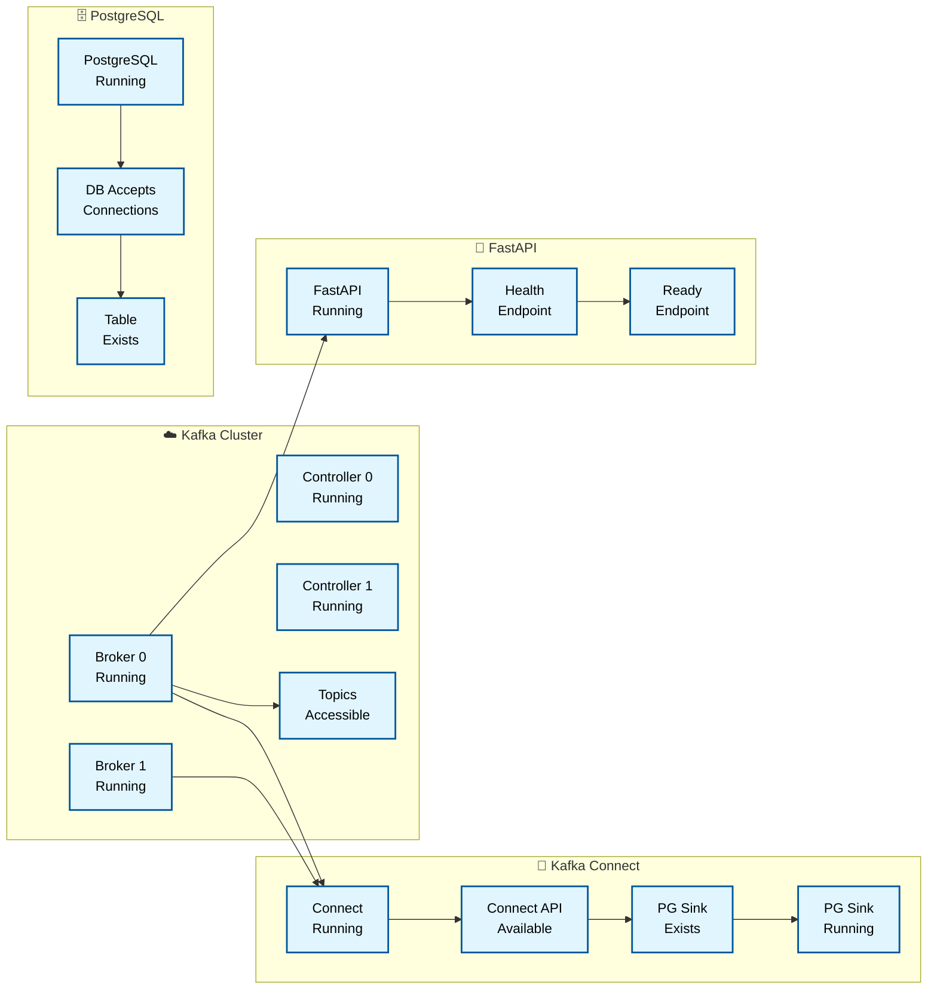
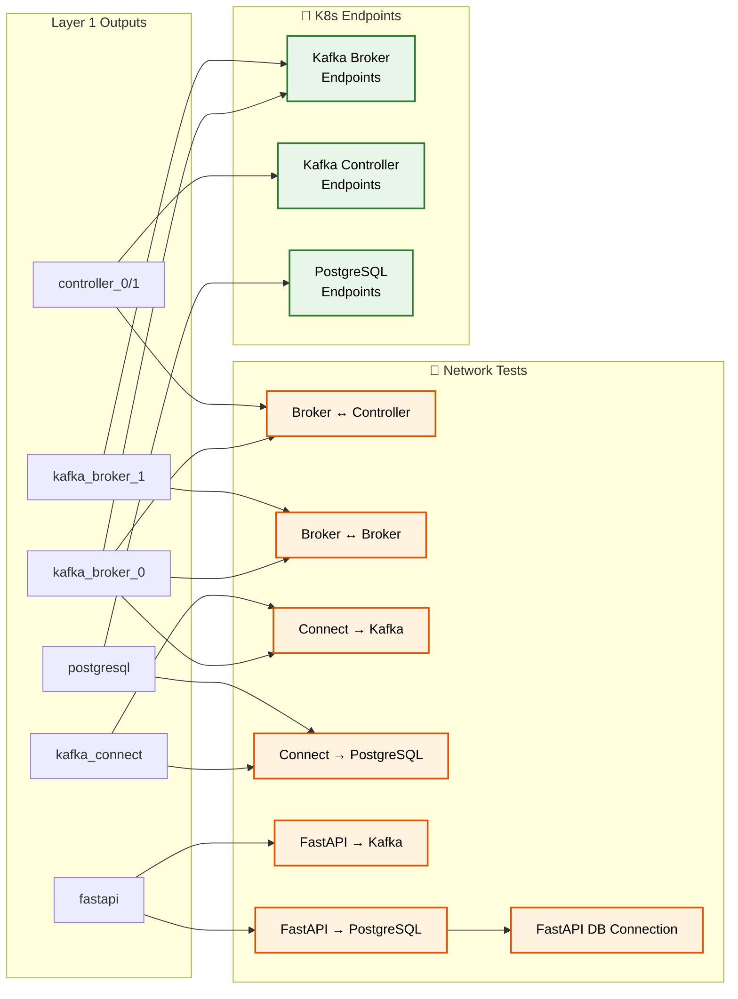
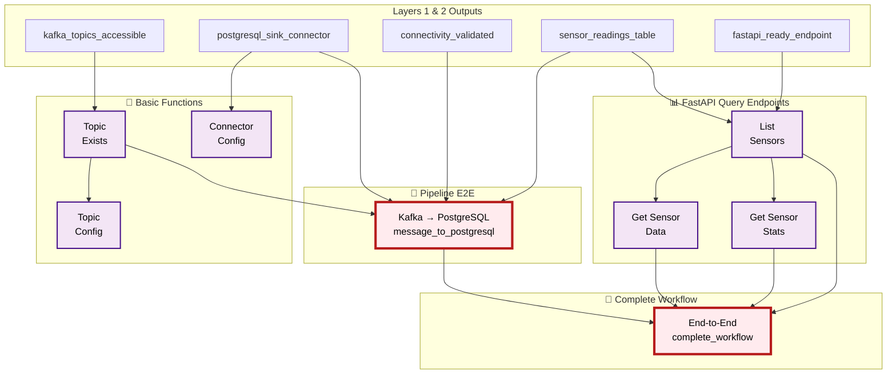
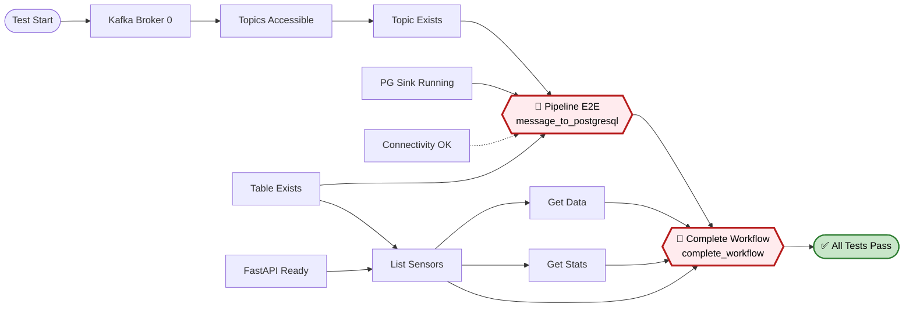

#### Dependency Graph

##### Layer 1: Health Checks (Foundation)

##### Layer 2: Connectivity Tests

##### Layer 3: Functional Tests (Integration)

##### Critical Path Visualization

**Legende:**
- 🔵 **Health (Layer 1):** Pod Status & Basic Endpoints
- 🟠 **Connectivity (Layer 2):** Network Communication Validation
- 🟣 **Functional (Layer 3):** Integration & Pipeline Tests
- 🔴 **Critical Path:** message_to_postgresql & complete_workflow
- 🟢 **Endpoints:** Kubernetes Service Endpoints
